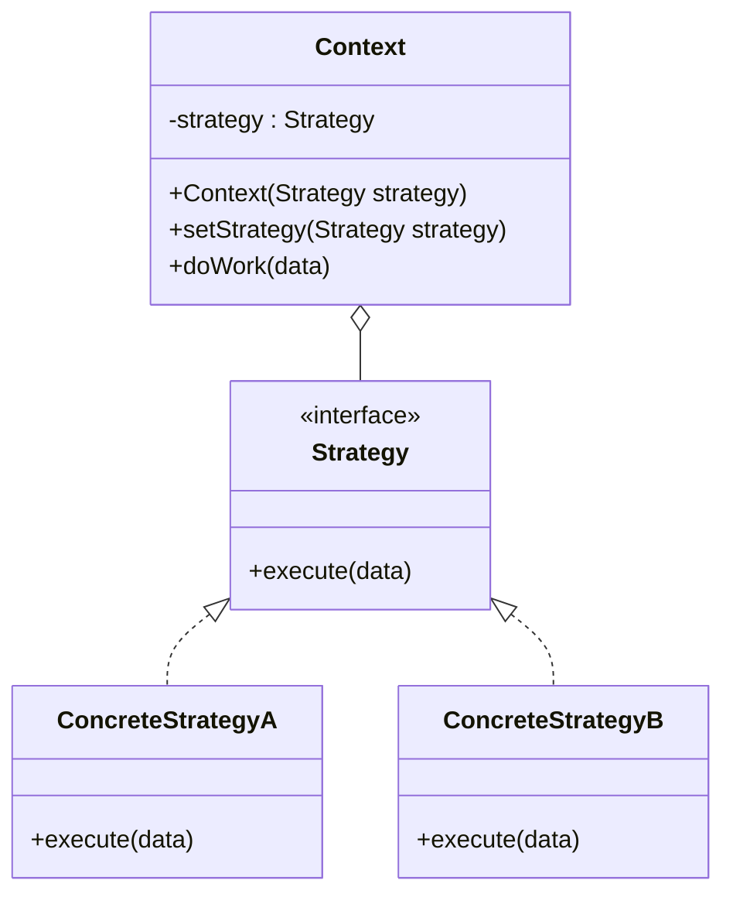

# Strategy

## Intent

Define a **family of algorithms**, encapsulate each one, and make them **interchangeable**. Strategy lets the algorithm vary independently from the clients that use it.

---

## Structure



---

## Pseudocode

```java
// Strategy interface
public interface SortStrategy {
    void sort(int[] data);
}

// Concrete strategies
public class BubbleSort implements SortStrategy {
    public void sort(int[] data) {
        System.out.println("Sorting with Bubble Sort...");
        // bubble sort logic
    }
}

public class QuickSort implements SortStrategy {
    public void sort(int[] data) {
        System.out.println("Sorting with Quick Sort...");
        // quicksort logic
    }
}

public class MergeSort implements SortStrategy {
    public void sort(int[] data) {
        System.out.println("Sorting with Merge Sort...");
        // merge sort logic
    }
}

// Context — delegates sorting to whichever strategy is set
public class DataProcessor {
    private SortStrategy strategy;

    public DataProcessor(SortStrategy strategy) {
        this.strategy = strategy;
    }

    public void setStrategy(SortStrategy strategy) {
        this.strategy = strategy;
    }

    public void process(int[] data) {
        strategy.sort(data);
    }
}

// Client — swaps strategies at runtime
DataProcessor processor = new DataProcessor(new QuickSort());
processor.process(new int[]{5, 2, 8, 1});

processor.setStrategy(new MergeSort());  // switch at runtime
processor.process(new int[]{9, 3, 7});
```

---

## Template

```java
// 1. Strategy interface
public interface Strategy {
    void execute(Object data);
}

// 2. Concrete strategies
public class ConcreteStrategyA implements Strategy {
    public void execute(Object data) { /* algorithm A */ }
}

public class ConcreteStrategyB implements Strategy {
    public void execute(Object data) { /* algorithm B */ }
}

// 3. Context — holds a reference to the active strategy
public class Context {
    private Strategy strategy;

    public Context(Strategy strategy) {
        this.strategy = strategy;
    }

    public void setStrategy(Strategy strategy) {
        this.strategy = strategy;
    }

    public void doWork(Object data) {
        strategy.execute(data);
    }
}

// 4. Client
Context ctx = new Context(new ConcreteStrategyA());
ctx.doWork(someData);

ctx.setStrategy(new ConcreteStrategyB());
ctx.doWork(someData);
```

> **Java lambdas:** When the Strategy interface has a single method, concrete strategies can be replaced with lambdas:
>
> ```java
> Context ctx = new Context(data -> System.out.println("Inline strategy: " + data));
> ```

---

## Applicability

Use Strategy when:

- You want to define a class that will have one behavior but that behavior can be swapped out for another.
- You have multiple variants of an algorithm and want to switch between them at runtime.
- A class has a large conditional statement that switches between algorithm variants — extract each branch into its own Strategy.
- You want to isolate algorithm implementation details from the code that uses the algorithm.

---

## How to Implement

1. **Declare a Strategy interface** with a single method representing the algorithm's entry point.
2. **Create ConcreteStrategy classes** — one per algorithm variant — each implementing the Strategy interface.
3. **Create a Context class** that holds a `Strategy` field (injected via constructor or setter).
4. **Add a `setStrategy()` method** if the strategy needs to change at runtime.
5. **Delegate the work** in Context's business method to `strategy.execute()` — Context knows nothing about the algorithm's internals.
6. **In the client**, choose and inject the appropriate strategy.
