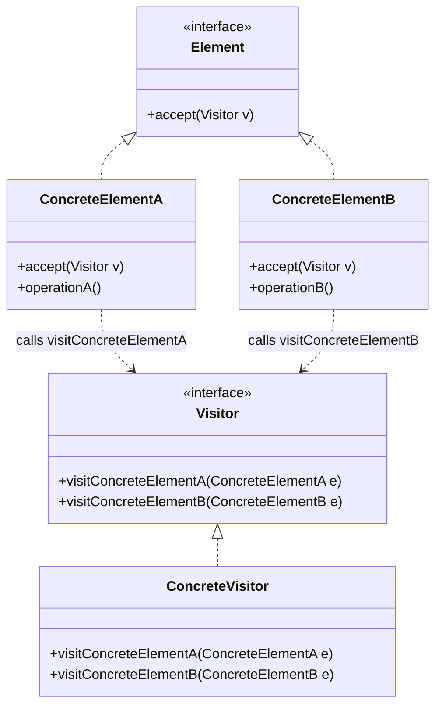

# Visitor

## Intent

**Separate an algorithm from the object structure** it operates on. Visitor lets you add new operations to existing class hierarchies without modifying those classes.

---

## Structure



---

## Pseudocode

```java
// Element interface
public interface ShapeElement {
    void accept(ShapeVisitor visitor);
}

// Concrete elements
public class Circle implements ShapeElement {
    public final double radius;

    public Circle(double radius) { this.radius = radius; }

    public void accept(ShapeVisitor visitor) {
        visitor.visitCircle(this);  // double dispatch
    }
}

public class Rectangle implements ShapeElement {
    public final double width, height;

    public Rectangle(double width, double height) {
        this.width = width; this.height = height;
    }

    public void accept(ShapeVisitor visitor) {
        visitor.visitRectangle(this);
    }
}

// Visitor interface
public interface ShapeVisitor {
    void visitCircle(Circle circle);
    void visitRectangle(Rectangle rectangle);
}

// Concrete visitor — adds an operation (area calculation) without touching elements
public class AreaCalculator implements ShapeVisitor {
    private double totalArea = 0;

    public void visitCircle(Circle c) {
        totalArea += Math.PI * c.radius * c.radius;
    }

    public void visitRectangle(Rectangle r) {
        totalArea += r.width * r.height;
    }

    public double getTotal() { return totalArea; }
}

// Another visitor — XML export, no changes to element classes
public class XmlExporter implements ShapeVisitor {
    public void visitCircle(Circle c) {
        System.out.println("<circle radius=\"" + c.radius + "\" />");
    }

    public void visitRectangle(Rectangle r) {
        System.out.println("<rectangle width=\"" + r.width + "\" height=\"" + r.height + "\" />");
    }
}

// Client
List<ShapeElement> shapes = List.of(new Circle(5), new Rectangle(3, 4), new Circle(2));

AreaCalculator calc = new AreaCalculator();
shapes.forEach(s -> s.accept(calc));
System.out.println("Total area: " + calc.getTotal());

shapes.forEach(s -> s.accept(new XmlExporter()));
```

---

## Template

```java
// 1. Element interface — must accept a Visitor
public interface Element {
    void accept(Visitor visitor);
}

// 2. Concrete elements — each calls the matching visit method (double dispatch)
public class ConcreteElementA implements Element {
    public void accept(Visitor visitor) {
        visitor.visitConcreteElementA(this);
    }
    public void operationA() { /* ... */ }
}

public class ConcreteElementB implements Element {
    public void accept(Visitor visitor) {
        visitor.visitConcreteElementB(this);
    }
}

// 3. Visitor interface — one visit method per concrete element type
public interface Visitor {
    void visitConcreteElementA(ConcreteElementA e);
    void visitConcreteElementB(ConcreteElementB e);
}

// 4. Concrete visitor — implements one operation across all element types
public class ConcreteVisitor implements Visitor {
    public void visitConcreteElementA(ConcreteElementA e) {
        // operation on A
    }
    public void visitConcreteElementB(ConcreteElementB e) {
        // operation on B
    }
}
```

> **Double dispatch explained:** calling `element.accept(visitor)` selects the right `accept()` (first dispatch on element type), which then calls `visitor.visitXxx(this)` to select the right visitor method (second dispatch on visitor type). This is how Visitor achieves type-safe polymorphism across two class hierarchies.

---

## Applicability

Use Visitor when:

- You need to perform many **distinct and unrelated operations** on an object structure without polluting their classes.
- The object structure rarely changes but you often add new operations to it.
- Operations need to accumulate state across the elements of the object structure (e.g., totals, reports).
- You want to add behavior to classes you can't modify (third-party or sealed hierarchies).

---

## How to Implement

1. **Declare a Visitor interface** with one `visit(ConcreteElementX)` method per concrete element type.
2. **Add an `accept(Visitor)` method** to the Element interface.
3. **Implement `accept()`** in each ConcreteElement by calling `visitor.visitXxx(this)` — this is the double dispatch mechanism.
4. **Create ConcreteVisitor classes**, each implementing a different operation across all element types.
5. **In the client**, traverse the object structure and call `element.accept(visitor)` on each element — the visitor accumulates results or performs side effects.
6. **To add a new operation**, create a new ConcreteVisitor — no changes to element classes needed.
