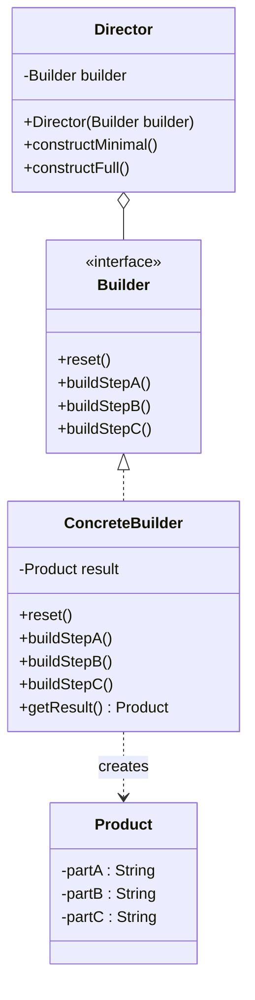

# Builder

## Intent

Separate the **construction** of a complex object from its **representation**, so the same construction process can create different representations.

---

## Structure



---

## Pseudocode

```java
// Product
public class HttpRequest {
    private final String method;
    private final String url;
    private final Map<String, String> headers;
    private final String body;
    private final int timeoutMs;

    private HttpRequest(Builder builder) {
        this.method    = builder.method;
        this.url       = builder.url;
        this.headers   = builder.headers;
        this.body      = builder.body;
        this.timeoutMs = builder.timeoutMs;
    }

    // Builder (static inner class)
    public static class Builder {
        private final String method;
        private final String url;
        private Map<String, String> headers = new HashMap<>();
        private String body = "";
        private int timeoutMs = 5000;

        public Builder(String method, String url) {
            this.method = method;
            this.url    = url;
        }

        public Builder header(String key, String value) {
            headers.put(key, value);
            return this;
        }

        public Builder body(String body) {
            this.body = body;
            return this;
        }

        public Builder timeout(int ms) {
            this.timeoutMs = ms;
            return this;
        }

        public HttpRequest build() {
            return new HttpRequest(this);
        }
    }
}

// Usage
HttpRequest req = new HttpRequest.Builder("POST", "https://api.example.com/users")
    .header("Content-Type", "application/json")
    .body("{\"name\": \"Alice\"}")
    .timeout(3000)
    .build();
```

---

## Template

```java
// Product — complex object being built
public class Product {
    private final String requiredA;
    private final String requiredB;
    private final String optionalC;  // optional
    private final int optionalD;     // optional

    private Product(Builder builder) {
        this.requiredA = builder.requiredA;
        this.requiredB = builder.requiredB;
        this.optionalC = builder.optionalC;
        this.optionalD = builder.optionalD;
    }

    // Static inner Builder
    public static class Builder {
        // Required fields set via constructor
        private final String requiredA;
        private final String requiredB;

        // Optional fields with defaults
        private String optionalC = "";
        private int optionalD = 0;

        public Builder(String requiredA, String requiredB) {
            this.requiredA = requiredA;
            this.requiredB = requiredB;
        }

        public Builder optionalC(String val) {
            this.optionalC = val;
            return this;
        }

        public Builder optionalD(int val) {
            this.optionalD = val;
            return this;
        }

        public Product build() {
            // Validate here if needed
            return new Product(this);
        }
    }
}

// Usage
Product p = new Product.Builder("a", "b")
    .optionalC("c")
    .optionalD(42)
    .build();
```

> **Director variant** — when you want to reuse specific construction sequences:
>
> ```java
> public class Director {
>     private final Product.Builder builder;
>
>     public Director(Product.Builder builder) {
>         this.builder = builder;
>     }
>
>     public Product constructMinimal() {
>         return builder.build();
>     }
>
>     public Product constructFull() {
>         return builder.optionalC("c").optionalD(42).build();
>     }
> }
> ```

---

## Applicability

Use Builder when:

- An object requires many constructor parameters, especially optional ones (avoids telescoping constructors).
- You want to construct different representations of the same product using the same building steps.
- Step-by-step construction is needed and the object should not be usable until fully built.
- You want immutable objects — the product is only created when `build()` is called.

---

## How to Implement

1. **Define the Product** as a class with a private constructor that accepts only the Builder.
2. **Create a static inner `Builder` class** inside the Product.
3. **Add required fields** as `final` fields in the Builder, set via the Builder's constructor.
4. **Add optional fields** as non-final Builder fields with sensible defaults.
5. **Add a fluent setter** for each optional field — each returns `this` so calls can be chained.
6. **Add a `build()` method** that calls `new Product(this)`, optionally validating required state first.
7. **(Optional) Add a Director** if you want to encapsulate common construction sequences and reuse them.
