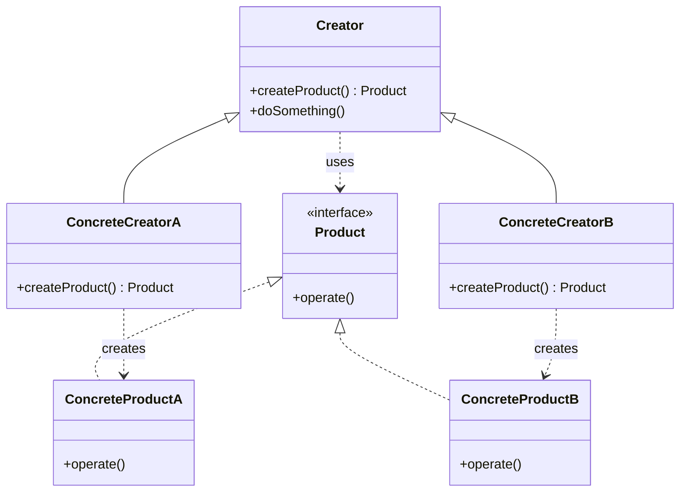

# Factory Method

## Intent

Define an interface for creating an object, but **let subclasses decide which class to instantiate**. Factory Method defers instantiation to subclasses.

---

## Structure



---

## Pseudocode

```java
// Product interface
public interface Notification {
    void send(String message);
}

// Concrete products
public class EmailNotification implements Notification {
    public void send(String message) {
        System.out.println("Email: " + message);
    }
}

public class SmsNotification implements Notification {
    public void send(String message) {
        System.out.println("SMS: " + message);
    }
}

// Creator — declares the factory method
public abstract class NotificationService {
    // Factory method
    public abstract Notification createNotification();

    // Uses the product without knowing its concrete type
    public void notify(String message) {
        Notification n = createNotification();
        n.send(message);
    }
}

// Concrete creators
public class EmailService extends NotificationService {
    public Notification createNotification() {
        return new EmailNotification();
    }
}

public class SmsService extends NotificationService {
    public Notification createNotification() {
        return new SmsNotification();
    }
}

// Client
NotificationService service = new EmailService();
service.notify("Your order has shipped.");
```

---

## Template

```java
// 1. Product interface
public interface Product {
    void operate();
}

// 2. Concrete products
public class ConcreteProductA implements Product {
    public void operate() { /* ... */ }
}

public class ConcreteProductB implements Product {
    public void operate() { /* ... */ }
}

// 3. Creator — contains the factory method
public abstract class Creator {
    // Factory method — subclasses override this
    public abstract Product createProduct();

    // Business logic that uses the product
    public void doSomething() {
        Product p = createProduct();
        p.operate();
    }
}

// 4. Concrete creators
public class ConcreteCreatorA extends Creator {
    public Product createProduct() {
        return new ConcreteProductA();
    }
}

public class ConcreteCreatorB extends Creator {
    public Product createProduct() {
        return new ConcreteProductB();
    }
}
```

---

## Applicability

Use Factory Method when:

- You don't know ahead of time what class to instantiate (the exact type is determined at runtime).
- You want subclasses to control which objects they create.
- You want to encapsulate object creation logic and keep it separate from business logic.
- You're building a framework or library and want to let users extend it by providing their own products.

---

## How to Implement

1. **Define a Product interface** (or abstract class) with the operations all concrete products must support.
2. **Create concrete product classes** that implement the Product interface.
3. **Create an abstract Creator class** with an abstract factory method that returns `Product`.
4. **Add business logic** to the Creator that calls the factory method — this code works against the `Product` interface, not a concrete type.
5. **Create concrete Creator subclasses** that override the factory method and return a specific concrete product.
6. **In the client**, instantiate the desired concrete creator and call the business logic method — the correct product is created behind the scenes.
