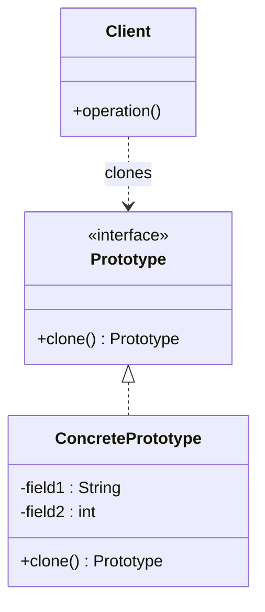

# Prototype

## Intent

Create new objects by **cloning an existing instance** (the prototype), rather than constructing from scratch. Delegate the copy logic to the object itself.

---

## Structure



---

## Pseudocode

```java
// Prototype interface (Java provides Cloneable, but a custom interface is clearer)
public interface Shape {
    Shape clone();
    void draw();
}

// Concrete prototype
public class Circle implements Shape {
    private int x, y, radius;
    private String color;

    public Circle(int x, int y, int radius, String color) {
        this.x = x; this.y = y;
        this.radius = radius; this.color = color;
    }

    // Copy constructor used by clone()
    private Circle(Circle other) {
        this.x = other.x; this.y = other.y;
        this.radius = other.radius; this.color = other.color;
    }

    @Override
    public Shape clone() {
        return new Circle(this);
    }

    @Override
    public void draw() {
        System.out.println("Circle at (" + x + "," + y + ") r=" + radius);
    }
}

// Usage
Circle original = new Circle(10, 20, 5, "red");
Circle copy = (Circle) original.clone();
// copy is a new object with the same field values
```

---

## Template

```java
// 1. Prototype interface
public interface Prototype {
    Prototype clone();
}

// 2. Concrete prototype
public class ConcretePrototype implements Prototype {
    private String field1;
    private int field2;
    // Deep-copy fields (e.g., mutable objects) as needed

    public ConcretePrototype(String field1, int field2) {
        this.field1 = field1;
        this.field2 = field2;
    }

    // Private copy constructor
    private ConcretePrototype(ConcretePrototype other) {
        this.field1 = other.field1;
        this.field2 = other.field2;
        // Deep-copy any mutable references here
    }

    @Override
    public Prototype clone() {
        return new ConcretePrototype(this);
    }
}

// 3. Optional prototype registry — stores named prototypes for quick cloning
public class PrototypeRegistry {
    private final Map<String, Prototype> registry = new HashMap<>();

    public void register(String key, Prototype prototype) {
        registry.put(key, prototype);
    }

    public Prototype get(String key) {
        return registry.get(key).clone();
    }
}
```

> **Note on `Cloneable`:** Java's built-in `Cloneable` + `Object.clone()` is widely considered broken (shallow copy, checked exception, no return type covariance before Java 5). Prefer a **copy constructor** or a custom `clone()` method as shown above.

---

## Applicability

Use Prototype when:

- Object construction is expensive (e.g., DB queries, heavy computation) and you need many similar objects.
- You need copies of objects at runtime without coupling to their concrete classes.
- Objects differ only in state — clone the base and tweak the copy rather than building from scratch.
- You want to avoid a class explosion of subclasses just to vary initialization parameters.

---

## How to Implement

1. **Declare a `clone()` method** in a Prototype interface (or abstract class).
2. **Implement a copy constructor** in each concrete class that copies all fields from the given instance.
3. **Implement `clone()`** to call the copy constructor — this keeps copy logic inside the class itself.
4. **Handle mutable fields carefully** — primitive fields and Strings copy safely, but mutable objects (collections, nested objects) require deep copying to avoid shared-state bugs.
5. **(Optional) Build a `PrototypeRegistry`** — a map of named prototypes. Clients ask the registry for a named copy instead of holding references to concrete classes.
