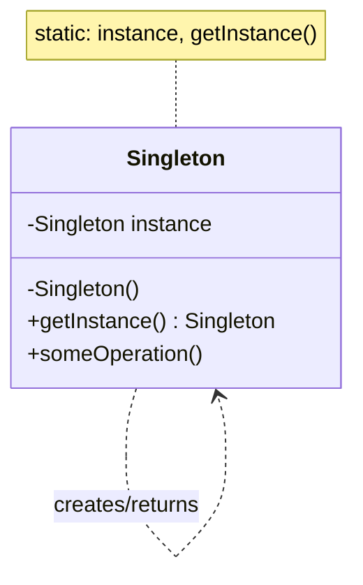

# Singleton

## Intent

Ensure a class has **only one instance** and provide a **global access point** to it.

---

## Structure



---

## Pseudocode

### Simple (non-thread-safe)

Good enough for single-threaded environments or a quick interview sketch.

```java
public class DatabaseConnection {
    private static DatabaseConnection instance;

    private DatabaseConnection() {
        // expensive setup: open connection pool
    }

    public static DatabaseConnection getInstance() {
        if (instance == null) {
            instance = new DatabaseConnection();
        }
        return instance;
    }

    public void query(String sql) { /* ... */ }
}
```

### Thread-safe (double-checked locking)

Use in multi-threaded contexts. The `volatile` keyword prevents the JVM from returning a partially constructed object.

```java
public class DatabaseConnection {
    private static volatile DatabaseConnection instance;

    private DatabaseConnection() {
        // expensive setup: open connection pool
    }

    public static DatabaseConnection getInstance() {
        if (instance == null) {
            synchronized (DatabaseConnection.class) {
                if (instance == null) {
                    instance = new DatabaseConnection();
                }
            }
        }
        return instance;
    }

    public void query(String sql) { /* ... */ }
}
```

---

## Template

### Simple (non-thread-safe)

```java
public class Singleton {
    private static Singleton instance;

    private Singleton() {}

    public static Singleton getInstance() {
        if (instance == null) {
            instance = new Singleton();
        }
        return instance;
    }

    public void doSomething() {}
}
```

### Thread-safe (double-checked locking)

```java
public class Singleton {
    private static volatile Singleton instance;

    private Singleton() {}

    public static Singleton getInstance() {
        if (instance == null) {
            synchronized (Singleton.class) {
                if (instance == null) {
                    instance = new Singleton();
                }
            }
        }
        return instance;
    }

    public void doSomething() {}
}
```

> **Simpler thread-safe alternative** — use an enum (inherently thread-safe, handles serialization):
>
> ```java
> public enum Singleton {
>     INSTANCE;
>
>     public void doSomething() {}
> }
>
> // Usage
> Singleton.INSTANCE.doSomething();
> ```

---

## Applicability

Use Singleton when:

- A single shared resource must be coordinated across the system (config, connection pool, logger, cache, thread pool).
- You need exactly one object to orchestrate actions (a scheduler, registry, or event bus).
- Instantiation is expensive and re-creating the object would be wasteful.

Avoid Singleton when:

- It hides dependencies (prefer dependency injection so callers receive the instance explicitly).
- It makes unit testing hard (a singleton carries state across tests — prefer injecting an interface).
- The "single instance" constraint is likely to change (a future multi-tenant system may need multiple instances).

---

## How to Implement

1. **Add a private static field** of the class's own type to hold the sole instance.
2. **Make the constructor private** so no outside code can call `new`.
3. **Create a public static `getInstance()` method** that returns the instance.
4. **Lazy-initialize** inside `getInstance()`: create the instance only on the first call, then return the same object on every subsequent call.
5. **For thread safety**, add `volatile` to the field and use **double-checked locking** — check `null` once before synchronizing (fast path) and once inside the `synchronized` block (safe path).
6. **Protect against reflection attacks** (optional, production-grade): throw an exception from the constructor if the instance already exists.
7. **Protect against serialization** (optional): implement `readResolve()` returning the existing instance, or use the enum variant which handles this automatically.
