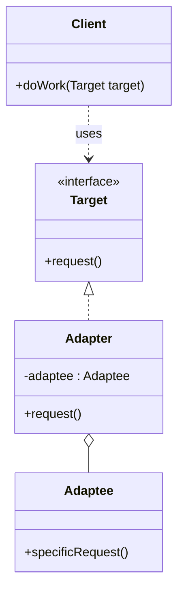

# Adapter

## Intent

Convert the interface of a class into another interface that clients expect. Adapter lets classes work together that couldn't otherwise because of **incompatible interfaces**.

---

## Structure



---

## Pseudocode

```java
// Target — the interface the client expects
public interface Logger {
    void log(String level, String message);
}

// Adaptee — existing class with an incompatible interface
public class LegacyAuditLogger {
    public void writeAudit(String entry) {
        System.out.println("[AUDIT] " + entry);
    }
}

// Adapter — wraps the Adaptee and implements the Target
public class LegacyLoggerAdapter implements Logger {
    private final LegacyAuditLogger legacy;

    public LegacyLoggerAdapter(LegacyAuditLogger legacy) {
        this.legacy = legacy;
    }

    @Override
    public void log(String level, String message) {
        legacy.writeAudit(level + ": " + message);
    }
}

// Client — works only with Logger, unaware of LegacyAuditLogger
public class OrderService {
    private final Logger logger;

    public OrderService(Logger logger) {
        this.logger = logger;
    }

    public void placeOrder(String item) {
        logger.log("INFO", "Order placed: " + item);
    }
}

// Wiring
Logger adapter = new LegacyLoggerAdapter(new LegacyAuditLogger());
OrderService service = new OrderService(adapter);
service.placeOrder("Laptop");
```

---

## Template

```java
// 1. Target interface — what the client expects
public interface Target {
    void request();
}

// 2. Adaptee — the existing class with the wrong interface
public class Adaptee {
    public void specificRequest() { /* ... */ }
}

// 3. Adapter — implements Target, delegates to Adaptee
public class Adapter implements Target {
    private final Adaptee adaptee;

    public Adapter(Adaptee adaptee) {
        this.adaptee = adaptee;
    }

    @Override
    public void request() {
        // Translate: call adaptee's method, transform params/return as needed
        adaptee.specificRequest();
    }
}

// 4. Client — only knows Target
public class Client {
    public void doWork(Target target) {
        target.request();
    }
}
```

---

## Applicability

Use Adapter when:

- You want to use an existing class but its interface doesn't match what you need.
- You're integrating a third-party library or legacy component you can't modify.
- You want multiple classes with incompatible interfaces to work together without changing either.

---

## How to Implement

1. **Identify the Target interface** — the interface the client already uses.
2. **Identify the Adaptee** — the existing class whose interface is incompatible.
3. **Create an Adapter class** that implements the Target interface.
4. **Add an Adaptee field** in the Adapter, injected via constructor.
5. **Implement each Target method** by translating the call to the appropriate Adaptee method(s), converting parameters and return types as needed.
6. **Wire it up** — inject the Adapter wherever the client expects a Target.
