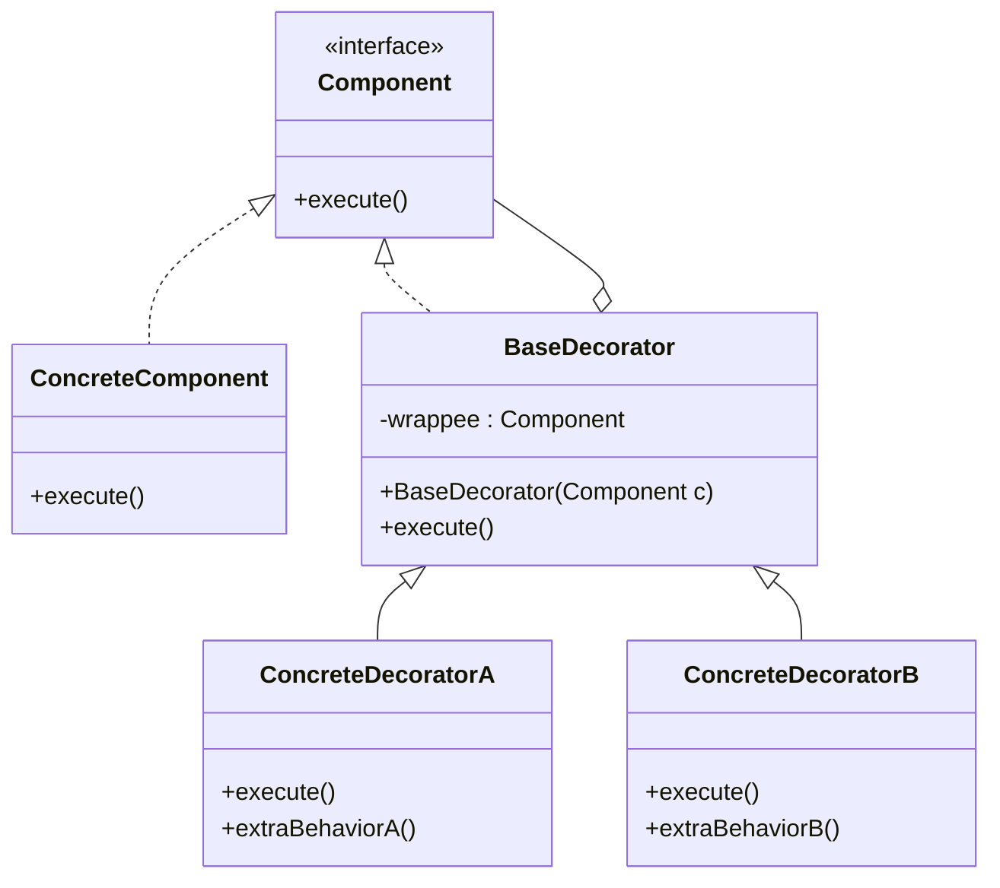

# Decorator

## Intent

Attach **additional responsibilities to an object dynamically** by wrapping it. Decorators provide a flexible alternative to subclassing for extending functionality.

---

## Structure



---

## Pseudocode

```java
// Component interface
public interface DataWriter {
    void write(String data);
}

// Concrete component
public class FileDataWriter implements DataWriter {
    public void write(String data) {
        System.out.println("Writing to file: " + data);
    }
}

// Base decorator — implements Component and holds a reference to a wrapped Component
public abstract class DataWriterDecorator implements DataWriter {
    protected final DataWriter wrappee;

    public DataWriterDecorator(DataWriter wrappee) {
        this.wrappee = wrappee;
    }

    public void write(String data) {
        wrappee.write(data);  // delegate by default
    }
}

// Concrete decorators
public class CompressionDecorator extends DataWriterDecorator {
    public CompressionDecorator(DataWriter wrappee) {
        super(wrappee);
    }

    @Override
    public void write(String data) {
        System.out.println("Compressing data...");
        super.write(data);
    }
}

public class EncryptionDecorator extends DataWriterDecorator {
    public EncryptionDecorator(DataWriter wrappee) {
        super(wrappee);
    }

    @Override
    public void write(String data) {
        System.out.println("Encrypting data...");
        super.write(data);
    }
}

// Usage — decorators stack via constructor wrapping
DataWriter writer = new CompressionDecorator(
                        new EncryptionDecorator(
                            new FileDataWriter()));
writer.write("Hello");
// Output:
// Compressing data...
// Encrypting data...
// Writing to file: Hello
```

---

## Template

```java
// 1. Component interface
public interface Component {
    void execute();
}

// 2. Concrete component — the base object being decorated
public class ConcreteComponent implements Component {
    public void execute() { /* core behavior */ }
}

// 3. Base decorator — delegates to the wrapped component
public abstract class BaseDecorator implements Component {
    protected final Component wrappee;

    public BaseDecorator(Component wrappee) {
        this.wrappee = wrappee;
    }

    public void execute() {
        wrappee.execute();
    }
}

// 4. Concrete decorators — add behavior before/after delegation
public class ConcreteDecoratorA extends BaseDecorator {
    public ConcreteDecoratorA(Component wrappee) {
        super(wrappee);
    }

    @Override
    public void execute() {
        // before
        super.execute();
        // after
    }
}
```

---

## Applicability

Use Decorator when:

- You want to add behavior to individual objects at runtime without affecting others of the same class.
- You need to combine behaviors in many permutations — subclassing would cause a class explosion.
- Extending via inheritance is impractical (e.g., final classes, or too many combinations).

---

## How to Implement

1. **Define a Component interface** with the operations all concrete components and decorators share.
2. **Create a ConcreteComponent** that implements the core behavior.
3. **Create a BaseDecorator** that implements Component and holds a `Component wrappee` field set via constructor. Its default `execute()` delegates to the wrappee.
4. **Create ConcreteDecorator subclasses** that extend BaseDecorator and override `execute()` to add behavior before and/or after calling `super.execute()`.
5. **Stack decorators** in the client by wrapping components in constructors — the outermost decorator is called first, each delegates inward.
