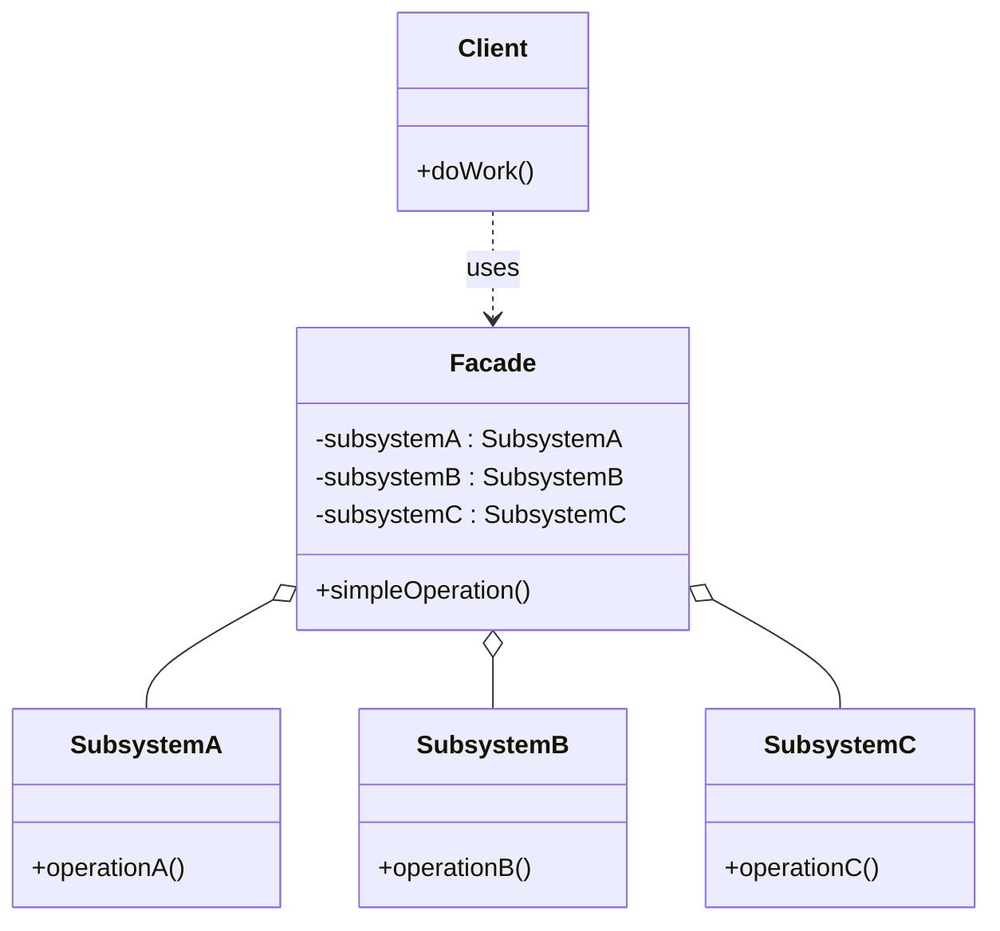

# Facade

## Intent

Provide a **simplified interface** to a complex subsystem of classes. The Facade doesn't encapsulate the subsystem — it just makes it easier to use.

---

## Structure



---

## Pseudocode

```java
// Complex subsystem classes
public class VideoDecoder {
    public byte[] decode(String filename) {
        System.out.println("Decoding video: " + filename);
        return new byte[0];
    }
}

public class AudioMixer {
    public void mix(byte[] videoData) {
        System.out.println("Mixing audio...");
    }
}

public class BitrateConverter {
    public void convert(byte[] data, int targetBitrate) {
        System.out.println("Converting to " + targetBitrate + " kbps...");
    }
}

// Facade — wraps the subsystem behind one simple method
public class VideoConverterFacade {
    private final VideoDecoder decoder = new VideoDecoder();
    private final AudioMixer mixer = new AudioMixer();
    private final BitrateConverter converter = new BitrateConverter();

    public void convert(String filename, int targetBitrate) {
        byte[] data = decoder.decode(filename);
        mixer.mix(data);
        converter.convert(data, targetBitrate);
        System.out.println("Done.");
    }
}

// Client — only interacts with the Facade
VideoConverterFacade facade = new VideoConverterFacade();
facade.convert("movie.mkv", 1080);
```

---

## Template

```java
// 1. Complex subsystem classes (already exist or are being built)
public class SubsystemA {
    public void operationA() { /* ... */ }
}

public class SubsystemB {
    public void operationB() { /* ... */ }
}

public class SubsystemC {
    public void operationC() { /* ... */ }
}

// 2. Facade — composes subsystem objects and exposes simple operations
public class Facade {
    private final SubsystemA a;
    private final SubsystemB b;
    private final SubsystemC c;

    public Facade() {
        this.a = new SubsystemA();
        this.b = new SubsystemB();
        this.c = new SubsystemC();
    }

    // Inject subsystems if you need testability / flexibility
    public Facade(SubsystemA a, SubsystemB b, SubsystemC c) {
        this.a = a; this.b = b; this.c = c;
    }

    public void simpleOperation() {
        a.operationA();
        b.operationB();
        c.operationC();
    }
}

// 3. Client — only uses Facade
Facade facade = new Facade();
facade.simpleOperation();
```

---

## Applicability

Use Facade when:

- You want to provide a clean, simple API over a complex or messy subsystem.
- You want to reduce dependencies between clients and subsystem internals (layer your code).
- You want to wrap a poorly designed third-party library so the rest of your code doesn't depend on it directly.
- Working in a layered architecture — each layer's entry point is a Facade.

---

## How to Implement

1. **Identify the complex subsystem** — a cluster of classes that clients interact with in an awkward or verbose way.
2. **Define the Facade class** — declare methods that cover the most common client use cases.
3. **Compose subsystem objects** as fields in the Facade (create them internally or inject them via constructor).
4. **Implement each Facade method** by orchestrating the correct sequence of subsystem calls.
5. **Route client code** to use the Facade instead of the subsystem directly — the subsystem classes can remain public for clients that need fine-grained access.
