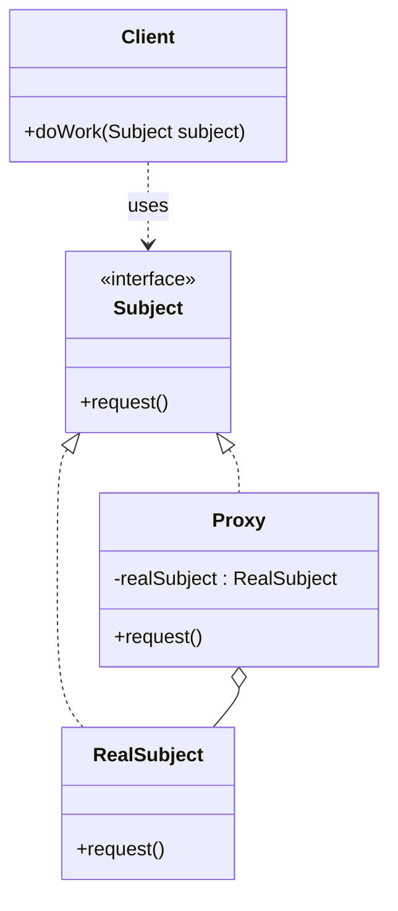

# Proxy

## Intent

Provide a **surrogate or placeholder** for another object to control access to it — for lazy initialization, access control, logging, caching, or remoting.

---

## Structure



---

## Pseudocode

```java
// Subject interface
public interface ImageLoader {
    void display();
}

// RealSubject — expensive to create
public class HighResImage implements ImageLoader {
    private final String filename;

    public HighResImage(String filename) {
        this.filename = filename;
        loadFromDisk();  // expensive!
    }

    private void loadFromDisk() {
        System.out.println("Loading image from disk: " + filename);
    }

    public void display() {
        System.out.println("Displaying: " + filename);
    }
}

// Proxy — lazy-loads the RealSubject on first use
public class LazyImageProxy implements ImageLoader {
    private final String filename;
    private HighResImage realImage;  // null until first access

    public LazyImageProxy(String filename) {
        this.filename = filename;  // cheap — no disk I/O yet
    }

    @Override
    public void display() {
        if (realImage == null) {
            realImage = new HighResImage(filename);  // load on demand
        }
        realImage.display();
    }
}

// Client
ImageLoader image = new LazyImageProxy("photo.jpg");
// No disk I/O yet
image.display();  // loads and displays
image.display();  // only displays — already loaded
```

---

## Template

```java
// 1. Subject interface
public interface Subject {
    void request();
}

// 2. RealSubject — the object being proxied
public class RealSubject implements Subject {
    public void request() { /* real work */ }
}

// 3. Proxy — same interface, controls access to RealSubject
public class Proxy implements Subject {
    private RealSubject realSubject;

    @Override
    public void request() {
        // Pre-processing: access check, logging, caching, lazy init...
        if (realSubject == null) {
            realSubject = new RealSubject();
        }

        realSubject.request();

        // Post-processing: logging, metrics...
    }
}
```

> **Common proxy types:**
>
> | Type | What it adds |
> |---|---|
> | **Virtual Proxy** | Lazy initialization — creates the real object only on first use |
> | **Protection Proxy** | Access control — checks permissions before forwarding |
> | **Caching Proxy** | Returns cached results for repeated requests |
> | **Logging Proxy** | Records calls before/after forwarding |
> | **Remote Proxy** | Represents an object in a different address space (e.g., RPC stub) |

---

## Applicability

Use Proxy when:

- **Lazy initialization** — the real object is expensive to create and may not always be needed.
- **Access control** — you want to allow only authorized callers to use the real object.
- **Caching** — you want to cache results of expensive operations in the real object.
- **Logging/monitoring** — you want to record requests without modifying the real object.
- **Remote access** — you want a local stand-in for an object that lives on a remote server.

---

## How to Implement

1. **Identify the Subject interface** that both the RealSubject and the Proxy will implement.
2. **Create the RealSubject** (or use an existing one) — this is the object whose access you're controlling.
3. **Create a Proxy class** that implements the Subject interface and holds a reference to the RealSubject (nullable for lazy init, or injected for protection/logging proxies).
4. **Implement each interface method** in the Proxy: add your cross-cutting logic (check, log, cache), then delegate to the RealSubject.
5. **Replace direct usage** of RealSubject with the Proxy in client code — clients use the Subject interface and are unaware of the proxy.
