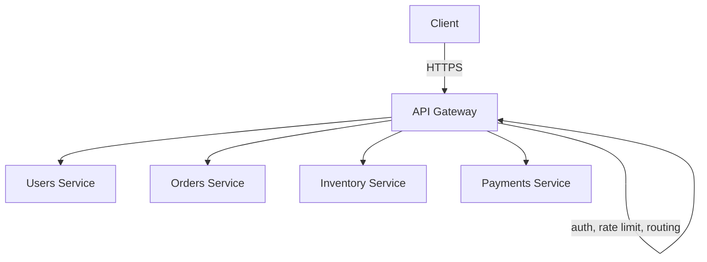

# API Gateway

## What It Solves
Gives clients a single, stable entry point into a system made of many backend services, so clients don't need to know about (or directly call) each individual service, and cross-cutting concerns like auth and rate limiting live in one place instead of being duplicated everywhere.

## How It Works

Every client request enters through the gateway rather than hitting backend services directly. The gateway handles authentication, rate limiting, request routing (often based on the URL path), and sometimes request/response transformation or aggregation. Backend services stay unaware of clients entirely — they only ever talk to the gateway.

### Responsibilities Commonly Centralized in the Gateway
- **Routing** — mapping incoming paths/hosts to the right backend service, often integrated with a service discovery mechanism so routes update automatically as services scale up or down.
- **Authentication & authorization** — validating tokens (JWT, OAuth) once at the edge instead of in every service.
- **Rate limiting & throttling** — see [Rate Limiting](rate-limiting.md); enforced centrally so every service benefits without reimplementing it.
- **TLS termination** — decrypting HTTPS at the gateway so internal services can communicate over plain HTTP within a trusted network.
- **Request/response transformation** — reshaping payloads, adding headers, or translating protocols (e.g., REST at the edge, gRPC internally) between the client and backend services.
- **Response aggregation (API composition)** — combining calls to multiple backend services into a single response for the client, reducing round trips for clients that would otherwise need to call several services themselves.

### Backend for Frontend (BFF)
A common variation is to run a **dedicated gateway per client type** (a web BFF, a mobile BFF) instead of one generic gateway for every client. Each BFF shapes and aggregates responses specifically for its client's needs — a mobile app might want a smaller, pre-aggregated payload, while a web client might want more granular endpoints — avoiding a single gateway trying to be everything to every client.

## When to Use
- A system built from multiple microservices that need a unified, client-facing API surface.
- When cross-cutting concerns (auth, rate limiting, logging, TLS termination) shouldn't be reimplemented in every service.
- Mobile or third-party clients that benefit from a stable API contract even as backend services evolve independently.
- Different client types (web, mobile, partner APIs) that need differently shaped responses from the same underlying services (BFF).

## Trade-offs
**Pros:**
- Centralizes cross-cutting concerns instead of duplicating them across every service.
- Decouples client-facing API shape from internal service boundaries — services can be split, merged, or replaced without breaking clients.

**Cons:**
- Becomes a single point of failure and a potential bottleneck unless it's made highly available and scaled itself.
- Can turn into a dumping ground for business logic that belongs in the services it fronts (the "god gateway" anti-pattern).
- Multiple BFFs mean multiple gateways to build, deploy, and keep secure, trading one bottleneck for more surface area to maintain.

## Real-World Examples
- Amazon API Gateway and Kong as managed/self-hosted API gateway products.
- Netflix's Zuul, used historically to front their microservice architecture.
- GraphQL gateways (Apollo Gateway) that compose multiple backend services into a single federated schema, a form of response aggregation.
