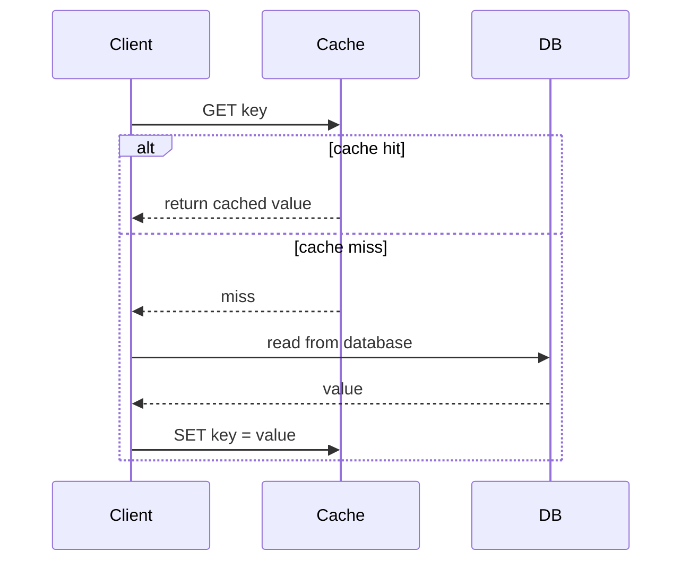

# Caching Strategies

## What It Solves
Reduces latency and database load by storing frequently accessed data in a faster-access layer (in-memory, usually), avoiding repeated expensive computation or storage reads.

## How It Works

This is the **cache-aside** (lazy-loading) pattern: the application checks the cache first, and on a miss, reads from the database and populates the cache for next time.

### Reading Techniques
- **Cache-aside (lazy loading)** — the application owns the logic: check cache, on miss read the database and populate the cache. Simple and resilient (a cache outage just means every request falls back to the database), but the first request for any key always pays the full miss cost, and the cache can go stale if the database changes underneath it.
- **Read-through** — the cache sits in front of the database as a library/proxy: the application only ever talks to the cache, and the cache itself is responsible for loading from the database on a miss. Keeps application code simpler than cache-aside at the cost of coupling the cache to the data-loading logic.

### Writing Techniques
- **Write-through** — every write goes to the cache and the database synchronously, as a single logical operation. Reads are always fresh, but every write pays the latency of both stores.
- **Write-behind (write-back)** — the write lands in the cache immediately and is flushed to the database asynchronously (batched or on a delay). Very fast writes, but risks losing unflushed data if the cache crashes, and can overwhelm the database if flushes are batched poorly.
- **Write-around** — writes go directly to the database, bypassing the cache; the cache is only populated on a subsequent read (cache-aside style). Avoids filling the cache with data that's written once and rarely read, at the cost of a guaranteed miss on the first read after a write.

### Eviction Policies
Since cache memory is finite, something has to decide what to evict when it fills up:
- **LRU (Least Recently Used)** — evicts the entry that hasn't been accessed for the longest time. The most common default; good general-purpose behavior for most access patterns.
- **LFU (Least Frequently Used)** — evicts the entry with the fewest accesses overall. Better than LRU for workloads with a stable set of "hot" keys, but slower to adapt when access patterns shift.
- **FIFO** — evicts the oldest-inserted entry regardless of access pattern. Cheap to implement, rarely optimal.
- **TTL (Time To Live)** — entries expire automatically after a fixed duration, independent of access pattern. Often combined with LRU/LFU as a safety net so stale data can't live forever even if it stays "hot."

### Cache Levels
Caching happens at multiple layers of a system simultaneously, not just one:
- **Client/browser cache** — HTTP caching via `Cache-Control` and `ETag` headers, avoiding a network round trip entirely.
- **CDN / edge cache** — caches static (and sometimes dynamic) responses close to the user; see the [Content Delivery Network](content-delivery-network.md) pattern.
- **Application / in-process cache** — an in-memory map inside the application process itself (fastest, but not shared across instances and lost on restart).
- **Distributed cache** — a shared cache tier (Redis, Memcached) that every application instance reads and writes, so cached data is consistent across a horizontally scaled fleet.
- **Database cache** — many databases maintain their own internal query/buffer cache, transparent to the application.

### Invalidation
Cache invalidation is widely considered one of the hardest problems in computer science for good reason:
- **TTL expiration** — the simplest approach; accept some staleness in exchange for never having to explicitly invalidate anything.
- **Explicit invalidation/eviction** — the write path actively deletes or updates the corresponding cache entry when the underlying data changes.
- **Versioned/keyed cache entries** — bake a version or timestamp into the cache key itself (e.g., `user:42:v3`) so an update naturally produces a new key instead of requiring a delete.

## When to Use
- Read-heavy workloads where the same data is requested repeatedly.
- Data that's expensive to compute or fetch (joins, aggregations, external API calls).
- Tolerance for slightly stale data — caching almost always trades some consistency for speed.

## Trade-offs
**Pros:**
- Dramatically reduces read latency and database load.
- Cache-aside is simple and resilient — a cache failure just means falling back to the database.

**Cons:**
- Cache invalidation is famously hard — stale data can be served if writes don't properly evict or update cached entries.
- Write-behind risks data loss if the cache fails before flushing to the database.
- Adds an extra moving part (and potential failure point) to the system.

## Real-World Examples
- Redis or Memcached in front of a relational database for API response caching.
- CDN edge caches (a specialized form of caching at the network layer).
- Browser and HTTP caching via `Cache-Control` headers.
- MySQL/InnoDB's buffer pool and PostgreSQL's shared buffers as built-in database-level caches.
