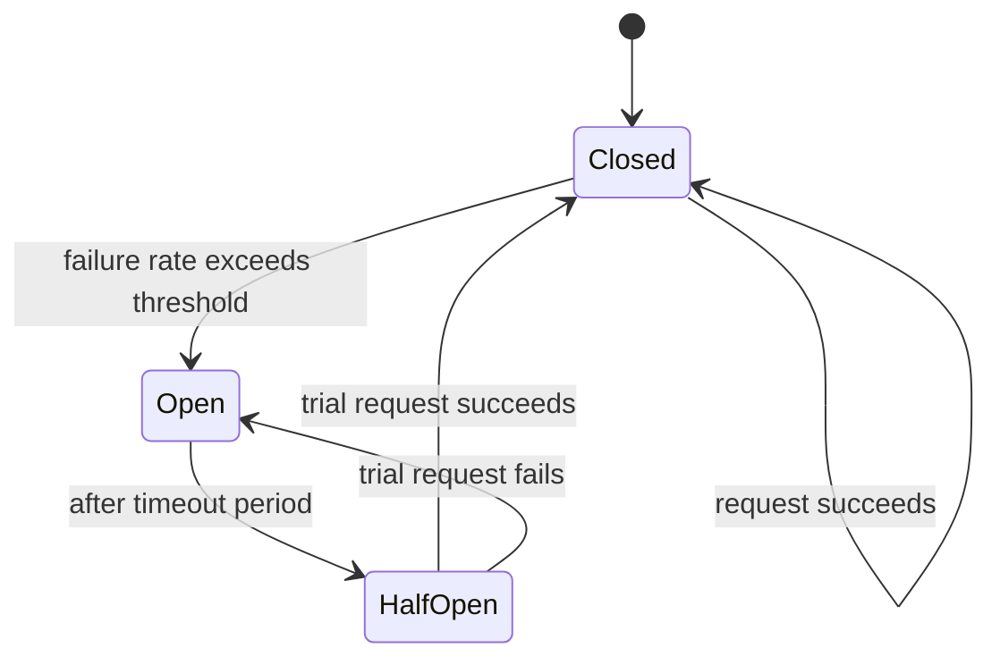

# Circuit Breaker

## What It Solves
Prevents a service from repeatedly calling a dependency that's already failing, which would otherwise waste resources, add latency, and risk cascading the failure back through the calling service.

## How It Works

In the **Closed** state, requests flow through normally, and the breaker tracks the failure rate. Once failures cross a threshold, the breaker trips to **Open** — every request fails immediately (or falls back to a default) without even attempting the call, giving the failing dependency room to recover. After a cooldown period, the breaker moves to **Half-Open** and lets a single trial request through: success closes the breaker again, failure reopens it.

### Related Resilience Techniques
Circuit breaking is usually one piece of a broader resilience strategy, often combined with:
- **Retries with backoff** — retrying a failed call after a delay that grows exponentially (and ideally with jitter, to avoid many clients retrying in lockstep), used for transient failures the circuit breaker hasn't yet tripped on.
- **Timeouts** — bounding how long a call is allowed to take, so a slow dependency doesn't tie up resources indefinitely even before the failure rate is high enough to trip the breaker.
- **Bulkheads** — isolating resources (thread pools, connection pools) per dependency, so a problem calling one dependency can't exhaust resources needed to call a different, healthy one — named after the watertight compartments in a ship's hull.
- **Fallbacks** — defining what to return when the breaker is open: a cached/stale value, a default response, or a degraded but still-useful experience, rather than surfacing a hard error to the end user.

## When to Use
- Any call to a remote dependency (another service, a database, a third-party API) that can fail or become slow.
- Systems where a failing dependency risks cascading — e.g., threads or connections piling up waiting on a slow downstream call, starving the whole service.

## Trade-offs
**Pros:**
- Fails fast instead of waiting out slow timeouts on every request, freeing up resources.
- Gives a struggling dependency breathing room to recover instead of being hammered by retries.

**Cons:**
- Needs careful tuning — thresholds and timeouts that are too aggressive trip the breaker on transient blips; too lenient and it doesn't protect anything.
- Adds a failure mode of its own (the breaker itself, and what the system does when it's open — a fallback, a cached value, or a clear error).

## Real-World Examples
- Netflix's Hystrix (now largely superseded by resilience4j) popularized the pattern for microservice-to-microservice calls.
- Most modern service meshes (Istio, Linkerd) implement circuit breaking as a built-in traffic policy.
- AWS SDKs and clients implementing adaptive retry modes combine circuit-breaker-like throttling with exponential backoff.
