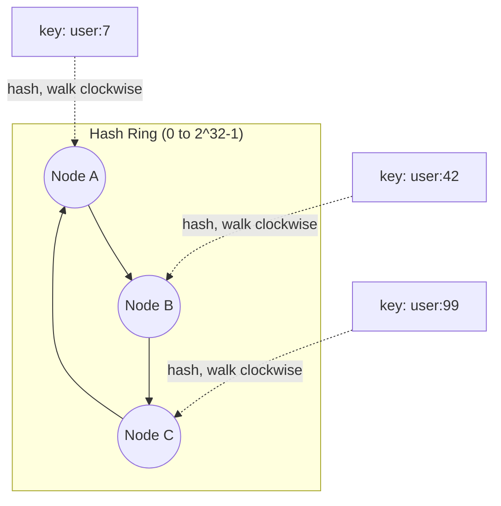

# Consistent Hashing

## What It Solves
Distributes keys across a set of nodes (cache servers, shards) in a way that minimizes remapping when nodes are added or removed — a plain `hash(key) % N` scheme reshuffles nearly every key whenever `N` changes.

## How It Works

Both nodes and keys are hashed onto the same circular space (the "ring"). A key belongs to the first node found walking clockwise from the key's position. When a node is added or removed, only the keys between it and its predecessor on the ring need to move — everything else stays put.

### Virtual Nodes
In practice, each physical node is placed at multiple points on the ring (**virtual nodes**, sometimes hundreds per physical node) rather than just once. Without virtual nodes, a small number of physical nodes can land unevenly on the ring by chance, giving some nodes much larger arcs (and therefore much more load) than others. Spreading many virtual nodes per physical node smooths this out, and also means that when one physical node is removed, its load is spread across many other nodes instead of dumping it all onto a single neighbor.

### Bounded Loads
A known refinement, **consistent hashing with bounded loads**, caps how much any single node can be overloaded relative to the average, by skipping forward on the ring to the next node whenever the "natural" node for a key is already carrying more than its fair share. This trades a small amount of the scheme's simplicity for a hard guarantee against hotspotting, which plain consistent hashing (even with virtual nodes) doesn't fully provide under skewed key popularity.

## When to Use
- Any distributed cache or sharded store where nodes are added or removed dynamically (autoscaling, node failure).
- Load balancing with session affinity, where you want the same client routed to the same server as much as possible even as the server pool changes.
- As the underlying mechanism for hash-based database sharding — see [Database Sharding](database-sharding.md).

## Trade-offs
**Pros:**
- Adding or removing a node remaps only `~1/N` of the keys instead of nearly all of them.
- Virtual nodes keep load balanced even with a small number of physical nodes.

**Cons:**
- More complex to implement and reason about than modulo hashing.
- Without virtual nodes, load can be uneven if nodes land close together on the ring.
- Skewed key popularity (a few very "hot" keys) can still overload a node unless bounded-load techniques are added on top.

## Real-World Examples
- Amazon DynamoDB and Apache Cassandra both use consistent hashing to distribute data across nodes.
- Memcached client libraries (e.g., `libketama`) use it to route keys across a cache cluster without a central coordinator.
- Content delivery and load balancer products use consistent hashing to keep a given client routed to the same backend as the pool scales.
