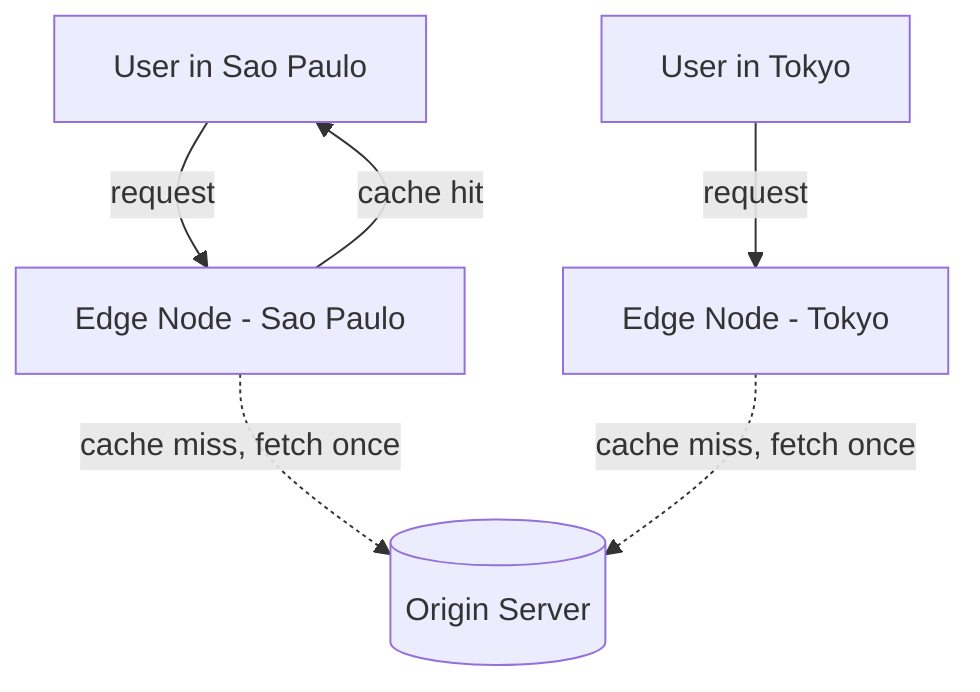

# Content Delivery Network (CDN)

## What It Solves
Serves static (and increasingly dynamic) content from servers geographically close to the requesting user, cutting latency and offloading traffic that would otherwise all hit the origin server.

## How It Works

A CDN operates a network of **edge nodes** distributed across many geographic locations. A user's request is routed (via DNS or Anycast) to the nearest edge node. If that node already has the content cached, it's served directly — no round trip to the origin. On a cache miss, the edge node fetches from the origin once, caches it, and serves it to the user, so subsequent nearby requests hit the cache.

### Push vs. Pull CDNs
- **Pull CDN** — the edge node fetches content from the origin lazily, on the first request for it (as shown above), and caches it according to TTL headers. Requires no upfront work from the origin, but the very first request for any object anywhere is always a cache miss.
- **Push CDN** — content is proactively uploaded to the CDN ahead of time, rather than pulled on demand. Better suited to a smaller set of large, infrequently changing files (e.g., video assets) where you want every edge node primed in advance rather than paying a first-request penalty per region.

### Static vs. Dynamic Content Acceleration
CDNs originated with static assets (images, CSS, JS, video) but modern CDNs also accelerate dynamic, per-user content:
- **Static content caching** — the classic case; content is identical for every user and can be cached for a long TTL.
- **Dynamic site acceleration** — even uncacheable, personalized responses benefit from a CDN by routing over the CDN's own optimized backbone network to the origin (skipping congested public internet paths), and by terminating the TCP/TLS handshake at the nearby edge node rather than all the way at the origin.
- **Edge compute** — running actual application logic at the edge (auth checks, A/B test bucketing, image resizing, HTML personalization) so it executes close to the user instead of always round-tripping to the origin.

### Cache Invalidation and Purging
Because content is duplicated across potentially hundreds of edge locations worldwide, invalidating it is slower and harder than invalidating a single cache: a **purge** request has to propagate to every edge node that might hold a copy, which can take anywhere from seconds to minutes depending on the provider. Techniques to avoid needing purges at all include versioned/fingerprinted URLs (`app.a1b2c3.js`) so a new deployment is simply a new cache key, and short TTLs for content that changes often.

### Signed URLs / Access Control
For content that shouldn't be publicly cacheable by just anyone with the URL (paid video, private files), CDNs support **signed URLs** or **signed cookies** — time-limited, cryptographically signed access tokens that the edge node validates before serving cached content, letting private content still benefit from edge caching.

## When to Use
- Serving static assets (images, video, JS/CSS bundles) to a geographically distributed user base.
- Reducing origin load and protecting against traffic spikes (a CDN absorbs most of the read traffic).
- Accelerating dynamic, personalized traffic via an optimized backbone and edge-terminated TLS, even when the response itself can't be cached.
- Edge compute use cases — running logic at the edge close to the user (auth checks, A/B routing, image resizing).

## Trade-offs
**Pros:**
- Dramatically lower latency for geographically distributed users.
- Absorbs the vast majority of read traffic away from the origin, improving origin resilience.
- Dynamic acceleration and edge compute extend the benefit beyond simple static caching.

**Cons:**
- Cache invalidation across a globally distributed network is slower and harder than invalidating a single cache.
- Not well suited to highly personalized or rapidly changing content without careful cache-key design (or signed URLs / short TTLs).
- Push CDNs require proactively managing what's uploaded, adding an operational step outside the normal request path.

## Real-World Examples
- Cloudflare, Akamai, and Amazon CloudFront as general-purpose CDNs.
- Video streaming platforms (YouTube, Netflix) operate purpose-built CDN infrastructure to serve video segments from edge locations.
- Cloudflare Workers and CloudFront Functions as examples of edge compute running application logic at the CDN layer.
