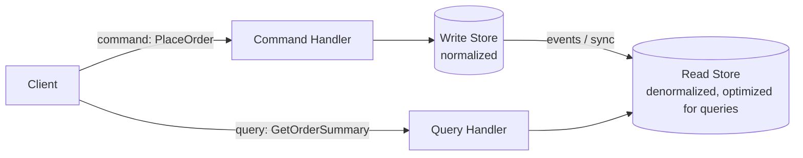

# CQRS (Command Query Responsibility Segregation)

## What It Solves
Separates the model used to write data (commands) from the model used to read it (queries), so each side can be optimized, scaled, and evolved independently instead of forcing one schema to serve both purposes well.

## How It Works

Writes go through a command handler into a write-optimized store (often normalized, with strong consistency guarantees). That store's changes are then propagated into one or more read stores shaped specifically for the queries the application needs, often heavily denormalized or even a different database technology entirely (e.g., a search index).

### Ways to Propagate Writes to Read Models
- **Synchronous update** — the command handler writes to both the write store and the read store(s) in the same transaction or request. Keeps read models immediately consistent, but couples their availability and latency to every write.
- **Database triggers** — the write store fires a trigger on change that updates the read model. Keeps propagation close to the data layer, but triggers are notoriously hard to test, version, and debug at scale.
- **Change Data Capture (CDC)** — a process (e.g., Debezium) tails the write database's replication/commit log and streams every change out as an event, which downstream consumers use to update read models. Decouples the write store from knowing about its read models entirely.
- **Event sourcing** — instead of a traditional write store, the source of truth *is* an append-only log of events (`OrderPlaced`, `OrderShipped`, ...). Read models are just materialized **projections** built by replaying that log, which also gives a full audit history and the ability to rebuild or add new read models at any time by replaying from the beginning.

### Read Model Shapes
Because CQRS decouples the read side from the write side's schema, different read models can be built for different needs from the same underlying writes: a relational denormalized view for one feature, a search index (Elasticsearch) for full-text queries, a graph database for relationship traversal, or a simple key-value cache for the highest-traffic lookups — all fed from the same write-side events.

## When to Use
- Read and write workloads have very different shapes or scaling needs (e.g., a small number of complex writes, a huge number of simple reads).
- The natural query shape doesn't match the natural write shape (e.g., writes are per-entity, but reads need cross-entity aggregates).
- Combined with event sourcing, where the write side is an append-only event log and read models are projections of it.

## Trade-offs
**Pros:**
- Read and write sides scale independently — add read replicas or a search index without touching the write model.
- Each side's schema can be shaped purely for its own purpose, instead of a compromise.
- Combined with event sourcing, gives a full audit trail and the ability to rebuild read models from scratch.

**Cons:**
- Asynchronous propagation means the read model can lag behind the write model — the classic CQRS consistency trade-off.
- Meaningfully more complexity than a single shared model: two schemas, a sync mechanism, and more moving parts to operate.
- Overkill for simple CRUD systems where reads and writes are already well-served by one model.

## Real-World Examples
- E-commerce systems where order placement (write) is transactional, but the product catalog and order history views (read) are served from a denormalized, search-indexed store.
- Event-sourced systems (e.g., banking ledgers) that project the write-side event log into multiple purpose-built read models.
- Debezium-based CDC pipelines that stream MySQL/Postgres changes into Elasticsearch or a data warehouse for read-optimized querying.
