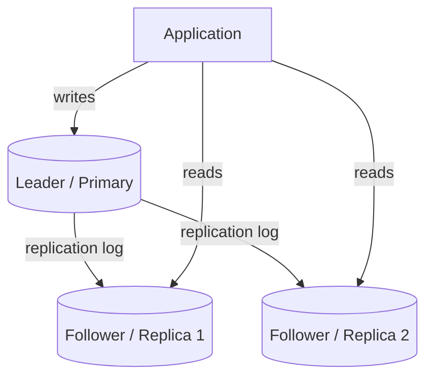

# Database Replication

## What It Solves
Keeps copies of the same data on multiple database instances for read scalability and fault tolerance, so a single instance failure doesn't take down the whole system.

## How It Works

In **leader-follower (primary-replica) replication**, all writes go to a single leader, which streams its write-ahead log to one or more followers. Followers apply the same changes and can serve read traffic, spreading read load across multiple instances. If the leader fails, a follower is promoted (manually or via automated failover).

### Replication Topologies
- **Single-leader (leader-follower)** — the topology shown above. All writes serialize through one leader, which is simple to reason about and avoids write conflicts, but the leader is a single point of failure and a ceiling on write throughput.
- **Multi-leader** — more than one node accepts writes (commonly one leader per data center), and leaders replicate changes to each other. Improves write availability and latency across regions, but introduces the possibility of conflicting writes to the same record that must be resolved (last-write-wins, custom merge logic, or CRDTs).
- **Leaderless (quorum-based)** — any replica can accept a write; the client (or a coordinator) writes to `W` replicas and reads from `R` replicas, and the system guarantees consistency as long as `W + R > N` (total replicas). No single node is special, which improves availability, but requires read-repair or anti-entropy processes to converge replicas that missed a write.

### Synchronous vs. Asynchronous
- **Synchronous replication** — the leader waits for one or more followers to confirm they've persisted a write before acknowledging it to the client. Guarantees no data loss on leader failure, at the cost of higher write latency (and reduced availability if a follower is slow or down).
- **Asynchronous replication** — the leader acknowledges the write immediately and replicates in the background. Much lower write latency, but a leader crash before replication completes loses the unreplicated writes.
- **Semi-synchronous** — a middle ground where the leader waits for acknowledgment from at least one follower (not all), balancing durability and latency.

## When to Use
- Read-heavy workloads where read traffic needs to scale independently of write traffic.
- Systems that need high availability — a follower can take over if the leader fails.
- Multi-region systems that want writes accepted close to users in each region (multi-leader or leaderless).

## Trade-offs
**Pros:**
- Scales read throughput horizontally.
- Provides a warm standby for failover, improving availability.

**Cons:**
- Replication lag means followers can serve stale data — reads immediately after a write may not reflect it (**read-your-writes** consistency problem).
- Failover isn't instantaneous and risks losing the last few unreplicated writes if the leader dies mid-flush (with asynchronous replication).
- Writes still bottleneck on a single leader unless combined with sharding (single-leader topology).
- Multi-leader and leaderless topologies trade that bottleneck for conflict resolution complexity.

## Real-World Examples
- PostgreSQL and MySQL both support native leader-follower replication, synchronous or asynchronous.
- Most managed databases (Amazon RDS, Cloud SQL) offer read replicas as a first-class feature.
- Amazon DynamoDB and Apache Cassandra use leaderless, quorum-based replication (`W`/`R`/`N` tunable consistency).
- CouchDB and some multi-region deployments of MySQL use multi-leader replication with conflict resolution.
