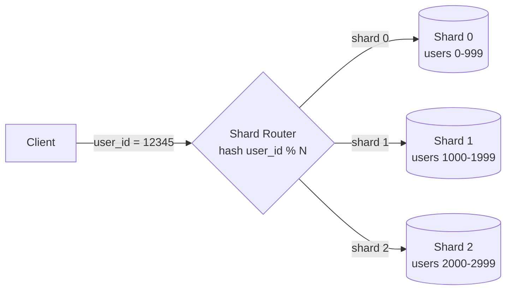

# Database Sharding

## What It Solves
Splits a dataset too large (or too high-throughput) for one database instance across multiple instances (shards), so each shard holds a subset of the data and handles a fraction of the load.

## How It Works

A **shard key** (e.g., `user_id`) determines which shard owns a given row. The application (or a routing layer) computes the shard key for every query and sends it to the right shard. Each shard is a fully independent database — no shard has visibility into another's data.

### Sharding Strategies
- **Range-based sharding** — each shard owns a contiguous range of the shard key (e.g., user IDs 0–999 on shard 0, 1000–1999 on shard 1). Easy to reason about and makes range queries efficient, but prone to hotspots if data or traffic isn't evenly distributed across ranges (e.g., all new users landing on the newest, highest-ID shard).
- **Hash-based sharding** — the shard key is hashed and the result determines the shard (often `hash(key) % N`, or via [consistent hashing](consistent-hashing.md) to minimize remapping). Spreads load evenly but sacrifices efficient range queries, since consecutive keys land on unrelated shards.
- **Directory-based sharding** — a separate lookup service maintains an explicit mapping from key to shard, rather than deriving it algorithmically. Very flexible (arbitrary rebalancing, moving individual keys), but adds an extra lookup and a new component that itself needs to be highly available.
- **Geo-based / entity-based sharding** — data is partitioned by a real-world dimension, like region (EU users on EU shards) or tenant (each customer's data on its own shard). Common in multi-tenant SaaS and systems with data-residency requirements.

### Resharding
Growing the number of shards after the fact is one of the hardest operational challenges in sharding: naive modulo-based schemes remap nearly every key when `N` changes, requiring a large, risky data migration. Systems that expect to reshard often build on consistent hashing (so only a fraction of keys move) or over-provision virtual shards from day one (e.g., 4096 logical shards mapped many-to-one onto physical nodes, so adding a node just remaps logical shards rather than rehashing all data).

## When to Use
- A single database instance can no longer handle the write throughput or dataset size, even after vertical scaling and read replicas.
- Data has a natural partition key that most queries filter by (e.g., `user_id`, `tenant_id`).

## Trade-offs
**Pros:**
- Near-linear scalability for both storage and write throughput.
- Smaller per-shard datasets mean faster backups, smaller indexes, less contention.

**Cons:**
- Queries that span shards (joins, aggregations across users) become expensive or impossible without a separate analytics layer.
- Resharding (changing the number of shards) is a genuinely hard, often online-migration-requiring operation.
- Transactions across shards lose the simplicity of a single-database ACID transaction.
- Uneven shard keys (a few very "hot" tenants or celebrity users) can create hotspots even with a technically balanced scheme.

## Real-World Examples
- MongoDB and Vitess (MySQL sharding) both implement sharding natively.
- Instagram famously shards Postgres by user ID range with a custom ID-generation scheme.
- Multi-tenant SaaS platforms that shard by `tenant_id`, sometimes isolating large customers onto their own dedicated shard.
