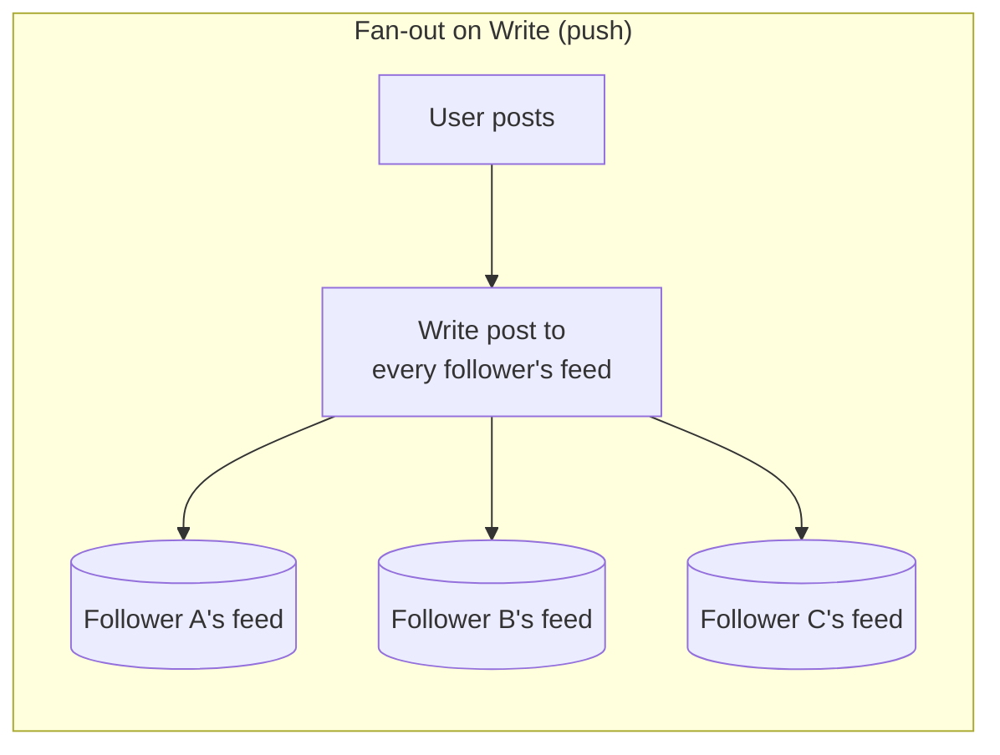
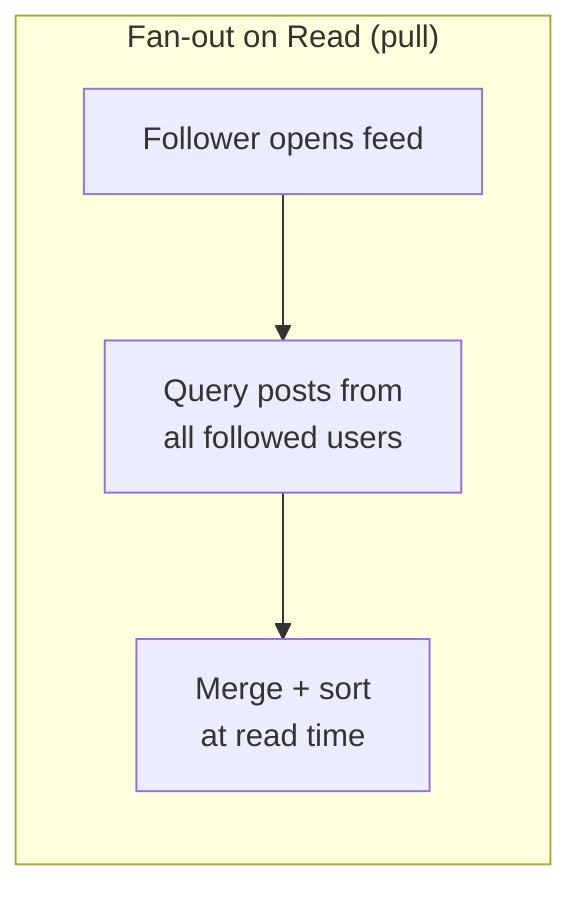

# Fan-out (Push vs. Pull)

## What It Solves
Determines when the work of distributing content to many recipients happens — at write time (as soon as content is created) or at read time (only when a recipient asks for it) — a core decision in any system where one write needs to reach many readers (social feeds, notifications).

## How It Works

**Fan-out on write (push)**: when a user posts, the system immediately writes that post into every follower's precomputed feed. Reading a feed is then just one fast lookup. **Fan-out on read (pull)**: nothing happens at post time; when a user opens their feed, the system queries and merges posts from everyone they follow on the spot. Most large-scale systems use a **hybrid**: push for typical users, pull for users with huge follower counts (celebrities), to avoid a single post triggering millions of writes.

### Hybrid Fan-out in Practice
A typical hybrid implementation sets a follower-count threshold (say, 10,000): accounts below it fan out on write as normal, since the write cost is bounded. Accounts above it are excluded from the push path entirely — a celebrity's post is *not* written into millions of feed inboxes. Instead, at read time, each follower's feed is built by merging their precomputed (pushed) feed with a live pull of posts from any celebrities they follow, combining fast reads for the common case with bounded write cost for the extreme case.

### Consistency Considerations
- **Push** feeds can go stale relative to the source of truth if a fan-out job fails partway through (some followers get the update, some don't) — this usually calls for a durable, retryable background job rather than fanning out synchronously in the request path.
- **Pull** feeds are always computed fresh from the source of truth, so there's no separate copy that can drift out of sync, at the cost of doing that merge work on every single read.

## When to Use
- **Push** when reads vastly outnumber writes and read latency matters most (the common case for social feeds).
- **Pull** when a small number of accounts have enormous fan-out (celebrities with millions of followers) — pushing to all of them on every post would be prohibitively expensive.
- **Hybrid** is the practical default for any system at real scale.

## Trade-offs
**Pros (push):** Very fast reads — the feed is precomputed.
**Pros (pull):** Cheap writes, no wasted work for content that's never read.
**Cons (push):** Expensive, slow writes for high-follower accounts; wasted work if a post is never read by some followers; feeds can drift if a fan-out job partially fails.
**Cons (pull):** Slower reads, since every feed load does real work merging multiple sources.

## Real-World Examples
- Twitter's well-documented hybrid model: regular users get fan-out on write, high-follower accounts are merged in at read time.
- Any notification system deciding between "write a notification row per recipient now" vs. "compute what to show when the user opens the notification center."
- Instagram's feed-ranking pipeline, which similarly blends precomputed candidate pools with real-time signals merged at read time.
