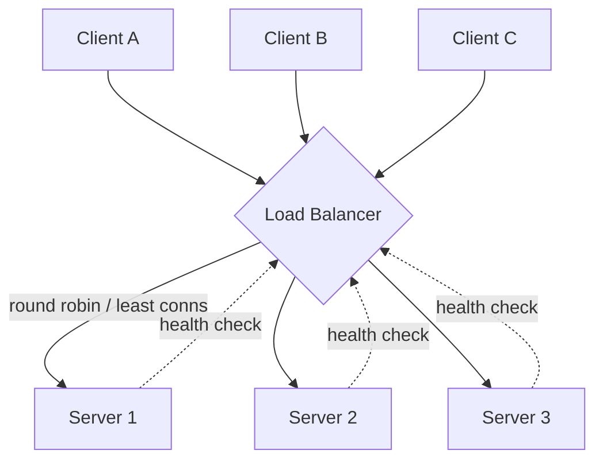

# Load Balancing

## What It Solves
Distributes incoming traffic across multiple servers so no single instance is overwhelmed, enabling horizontal scaling and eliminating a single point of failure at the compute layer.

## How It Works

A load balancer sits in front of a pool of identical (or near-identical) servers. Every incoming request is routed to one server using a selection strategy. The load balancer continuously health-checks each server and stops routing to any that fail, so traffic automatically drains away from unhealthy instances.

### Selection Algorithms
- **Round robin** — cycles through servers in order. Simple and fair when servers and requests are roughly uniform, but ignores actual server load.
- **Weighted round robin** — like round robin, but servers with more capacity get proportionally more requests. Useful in a mixed-capacity fleet.
- **Least connections** — routes to whichever server currently has the fewest open connections. Adapts better than round robin when request processing times vary widely.
- **Least response time** — routes based on a combination of active connections and recent response latency, aiming for the server that will answer fastest.
- **IP hash / consistent hashing** — derives the target server from a hash of the client's IP (or another key), giving the same client the same server on every request without server-side session storage. See [Consistent Hashing](consistent-hashing.md) for how this stays stable as the server pool changes.
- **Random / random with two choices** — picks a server at random (optionally comparing two random picks and choosing the less loaded one), which surprisingly performs close to least-connections with far less bookkeeping at very large scale.

### Layers
- **Layer 4 (transport layer)** — balances based on IP and TCP/UDP port only, without inspecting the request itself. Fast and protocol-agnostic, but can't make routing decisions based on HTTP content.
- **Layer 7 (application layer)** — understands HTTP, so it can route by path, header, or cookie, terminate TLS, and even rewrite requests. More flexible, at the cost of more CPU work per request.

### Topologies
- **DNS load balancing** — resolves a hostname to multiple IPs (or different IPs per region), spreading load before a connection is even made. Coarse-grained — DNS caching means changes propagate slowly and it can't react to server health in real time on its own.
- **Hardware vs. software load balancers** — dedicated hardware appliances (traditionally F5) offer raw throughput; software load balancers (NGINX, HAProxy, Envoy) run on commodity infrastructure and are far more common in cloud-native systems today.
- **Global server load balancing (GSLB)** — routes traffic to the nearest or healthiest *data center*, not just the nearest server within one, typically combining DNS-based geo-routing with health checks across regions.

## When to Use
- Any service that needs to scale beyond what a single server can handle.
- Whenever availability matters — a load balancer removes a single point of failure at the application tier.
- Multi-region systems that need to route users to the nearest or healthiest region (GSLB), not just balance within one.

## Trade-offs
**Pros:**
- Enables horizontal scaling and eliminates a single point of failure.
- Health checks provide automatic failover.

**Cons:**
- The load balancer itself can become a bottleneck or single point of failure unless it's made redundant (active-passive pair, or DNS-based multi-LB setup).
- Sticky sessions (routing a user to the same server) reintroduce state affinity, complicating scaling and failover.

## Real-World Examples
- AWS Elastic Load Balancer / Google Cloud Load Balancing in front of application servers.
- NGINX or HAProxy as a self-managed layer 7 load balancer.
- Envoy as the data-plane load balancer inside most modern service meshes.
- DNS round robin as a cheap, coarse-grained load balancing layer.
