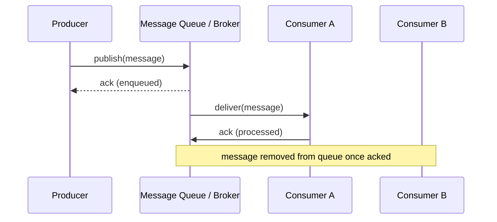

# Message Queues (Pub-Sub / Async Processing)

## What It Solves
Decouples the producer of work from the consumer that processes it, so the producer doesn't have to wait for (or even know about) whoever handles the work — smoothing out traffic spikes and letting each side scale and fail independently.

## How It Works

A producer publishes a message to a queue (or topic) and moves on immediately — it doesn't block waiting for the work to be done. One or more consumers pull messages off the queue and process them independently, acknowledging each message once it's handled. If a consumer crashes mid-processing, an unacknowledged message is redelivered.

### Messaging Patterns
- **Point-to-point (work queue)** — each message is delivered to exactly one consumer among a pool, used to distribute work items across a fleet of workers (e.g., image resizing jobs).
- **Publish-subscribe (topics)** — each message is delivered to every subscriber, used for fan-out — many independent services reacting to the same event (e.g., an "order placed" event triggering billing, shipping, and analytics independently).
- **Priority queues** — messages are dequeued by priority rather than strict FIFO order, so urgent work (e.g., a password reset email) can jump ahead of routine work.
- **Delayed / scheduled queues** — a message becomes visible to consumers only after a specified delay, used for things like retry backoff or "send this reminder in 24 hours."
- **Dead-letter queues (DLQ)** — messages that repeatedly fail processing (exceeding a retry limit) are routed to a separate queue for inspection, instead of being retried forever or silently dropped.

### Delivery Semantics
- **At-most-once** — a message may be lost but is never delivered twice. Simplest, but risky for anything that must not be dropped.
- **At-least-once** — a message is guaranteed to be delivered, but may be delivered more than once (e.g., if an ack is lost after processing but before the broker records it). The most common guarantee in practice, and it requires consumers to be **idempotent** — safe to process the same message twice without side effects.
- **Exactly-once** — the ideal, but genuinely hard to guarantee end-to-end across a distributed system; usually achieved only within a narrow scope (e.g., Kafka's exactly-once semantics within its own transactional producer/consumer API), not as a general property of arbitrary producers and consumers.

### Ordering
Some brokers guarantee strict ordering only within a partition or a single queue (not globally across many consumers or partitions) — a design choice that trades throughput (parallelism across partitions) against the ability to reason about global message order.

## When to Use
- Work that doesn't need to complete before responding to the original request (sending an email, generating a thumbnail, processing a payment webhook).
- Smoothing bursty traffic — the queue absorbs a spike, and consumers drain it at a sustainable rate.
- Decoupling services so a slow or down consumer doesn't take down the producer.
- Fanning a single event out to many independent downstream consumers (pub-sub).

## Trade-offs
**Pros:**
- Producers and consumers scale and deploy independently.
- Natural buffer against traffic spikes and consumer downtime.
- Failed processing can be retried without the producer knowing anything went wrong.

**Cons:**
- Introduces eventual consistency — the work isn't done by the time the producer's request returns.
- Message ordering and exactly-once delivery are genuinely hard guarantees to provide; most systems offer at-least-once and expect idempotent consumers.
- Adds operational complexity: another system to run, monitor, and reason about (dead-letter queues, retry policies, poison messages).

## Real-World Examples
- Amazon SQS and RabbitMQ for point-to-point task queues.
- Apache Kafka for high-throughput pub-sub with durable, replayable logs and partition-level ordering.
- Amazon SNS and Google Pub/Sub for pure fan-out pub-sub messaging.
- Webhook processing pipelines that queue incoming events for async handling.
