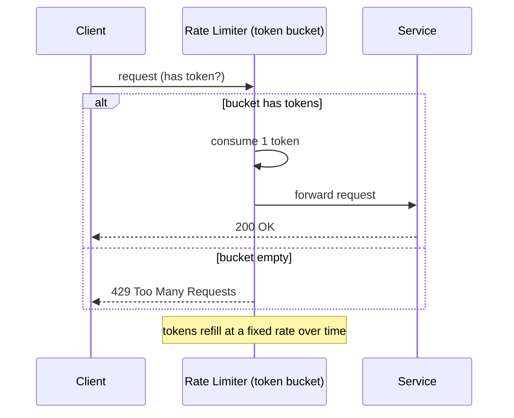

# Rate Limiting

## What It Solves
Caps how many requests a client (user, API key, IP) can make in a given time window, protecting a service from being overwhelmed — whether by abuse, bugs, or legitimate traffic spikes.

## How It Works

### Algorithms
- **Token bucket** — each client has a bucket holding up to `N` tokens that refills at a fixed rate. Each request consumes one token; an empty bucket means the request is rejected (or queued). Naturally allows short bursts up to the bucket size while enforcing a steady average rate — the most commonly used algorithm in practice.
- **Leaky bucket** — requests enter a fixed-size queue ("bucket") and are processed ("leak out") at a constant rate, regardless of how bursty the input is. Smooths traffic into a steady output rate but adds queueing latency, and a full bucket still drops or rejects new requests.
- **Fixed window counter** — counts requests in discrete time windows (e.g., 100 requests per minute, reset every minute on the clock). Simple and cheap, but allows up to `2N` requests in a short span around a window boundary (e.g., 100 at 11:59:59 and another 100 at 12:00:00).
- **Sliding window log** — keeps a timestamp for every request and counts how many fall within the trailing window. Perfectly accurate, but memory cost grows with request volume since every timestamp must be retained.
- **Sliding window counter** — approximates the sliding window log by weighting counts from the current and previous fixed windows, giving most of the accuracy of the log approach at a fraction of the memory.

### Scope and Granularity
Rate limits can be applied at different levels simultaneously: per-user, per-API-key, per-IP address, per-endpoint, or globally across an entire service — a public API commonly layers several of these together (e.g., a generous per-IP limit alongside a stricter per-account limit).

## When to Use
- Public APIs, to enforce fair usage and protect backend capacity.
- Protecting a downstream dependency (e.g., a third-party API with its own rate limits) from being overwhelmed by your own service.
- Mitigating abuse (login attempts, scraping, DDoS-style traffic).

## Trade-offs
**Pros:**
- Protects backend capacity and provides predictable behavior under load.
- Token bucket and leaky bucket allow reasonable burstiness without sacrificing the long-term rate guarantee.

**Cons:**
- Needs shared, low-latency state (typically Redis) to rate-limit consistently across multiple service instances — a purely local, per-instance counter under-limits once traffic is load-balanced across many servers.
- Choosing the right limit is a product decision as much as an engineering one — too strict frustrates legitimate users, too loose doesn't protect anything.
- Fixed window is cheap but imprecise; sliding window log is precise but memory-hungry — most production systems land on sliding window counter as the practical middle ground.

## Real-World Examples
- Stripe and GitHub both document token-bucket-style rate limits on their public APIs, returned via `X-RateLimit-*` headers.
- NGINX's `limit_req` module implements a leaky-bucket rate limiter at the reverse proxy layer.
- Cloudflare and API gateways (Kong, Amazon API Gateway) offer configurable sliding-window rate limiting as a built-in feature.
