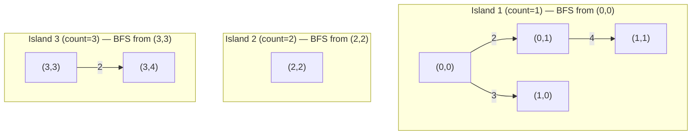
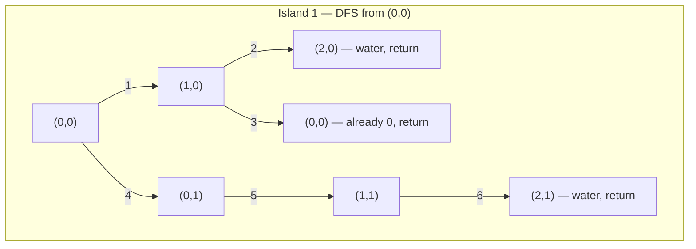
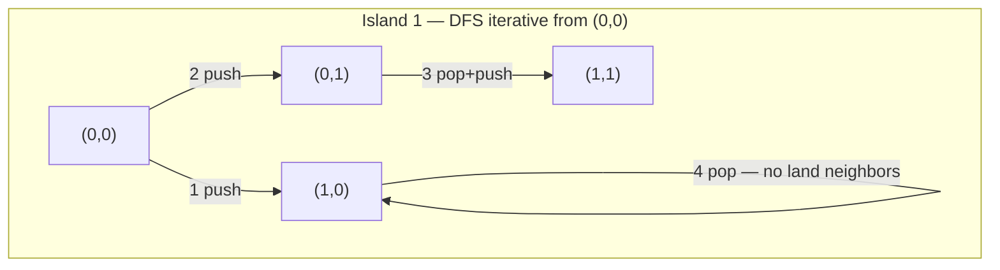

# Number of Islands — Review

| | |
|---|---|
| **Solved on** | 2026-06-13 |
| **DSA Category** | Graphs |

---

### 1. Your Solution Assessment

#### Original approach (DFS — recursive)

Your first instinct was a recursive DFS "island sinking" strategy:

- Scan every cell. When a `'1'` is found, increment the count and call `sinkIsland` recursively to mark the whole connected component as `'0'`.
- Each recursive call immediately marks the cell `'0'` and fans out to all four neighbors.

**Correctness:** Logically correct for all cases. The island-sinking trick elegantly avoids a separate `visited` array by mutating the grid in place.

**Code quality:** Clean and readable. Good naming (`sinkIsland` communicates intent). The guard clauses at the top of the recursive method are well-ordered (bounds check before value check). The directions array is a solid pattern.

**Time complexity — O(m × n):** Every cell is visited at most twice — once in the outer scan and once when it gets sunk.

**Space complexity — O(m × n) worst case:** The implicit call stack can grow as deep as the total number of land cells. On a fully-land grid of size m × n this causes a `StackOverflowError`, which is exactly what happened on the 300 × 300 test.

---

#### Final approach (BFS — iterative)

After hitting the stack limit, you switched to an iterative BFS using an explicit `Deque`. The outer loop and sinking logic are identical; only `sinkIsland` changed.

**Correctness:** Handles all cases, including the 300 × 300 boundary. Marking cells `'0'` on enqueue (not dequeue) is the right call — it prevents the same cell from being added to the queue multiple times.

**Code quality:** Still clean. The `Deque` as a queue (`add` / `poll`) is idiomatic Java.

**Time complexity — O(m × n):** Same as DFS — every cell is processed once.

**Space complexity — O(min(m, n)):** BFS queue holds at most the cells on the "frontier". In the worst case this is proportional to the shorter grid dimension.

**Algorithm trace** — Input: Example 2 (3 islands)

```
Grid:
  1 1 0 0 0
  1 1 0 0 0
  0 0 1 0 0
  0 0 0 1 1
```



Edge labels = order in which cells are enqueued within each island's BFS.

---

### 2. Optimal Approach

BFS iterative (your final solution) is already optimal. It shares the same asymptotic complexity as DFS but avoids the call-stack pitfall on large inputs.

```java
public int numIslands(char[][] grid) {
    if (grid == null || grid.length == 0) return 0;

    int count = 0;
    int[][] directions = {{0, 1}, {0, -1}, {1, 0}, {-1, 0}};

    for (int row = 0; row < grid.length; row++) {
        for (int col = 0; col < grid[0].length; col++) {
            if (grid[row][col] == '1') {
                count++;
                Deque<int[]> queue = new ArrayDeque<>();
                grid[row][col] = '0';
                queue.add(new int[]{row, col});

                while (!queue.isEmpty()) {
                    int[] cell = queue.poll();
                    for (int[] dir : directions) {
                        int r = cell[0] + dir[0];
                        int c = cell[1] + dir[1];
                        if (r >= 0 && r < grid.length && c >= 0 && c < grid[0].length
                                && grid[r][c] == '1') {
                            grid[r][c] = '0';
                            queue.add(new int[]{r, c});
                        }
                    }
                }
            }
        }
    }

    return count;
}
```

**Time — O(m × n):** Each cell is enqueued and dequeued at most once.
**Space — O(min(m, n)):** Queue size is bounded by the BFS frontier width.

**Algorithm trace** — Input: same grid as above


---

### 3. Alternative Approaches

#### DFS — recursive (your original)

Scan the grid, and for each unvisited land cell, recurse into all four neighbors to sink the island.

**Time — O(m × n):** Every cell visited once.
**Space — O(m × n):** Call stack depth equals the size of the largest island in the worst case.
**When acceptable:** Fine for small grids or when the input is guaranteed to have small islands. Fails under JVM default stack limits on large grids like 300 × 300 all-land.

```java
void sinkIsland(char[][] grid, int row, int col) {
    if (row < 0 || row >= grid.length || col < 0 || col >= grid[0].length) return;
    if (grid[row][col] == '0') return;

    grid[row][col] = '0';

    sinkIsland(grid, row + 1, col);
    sinkIsland(grid, row - 1, col);
    sinkIsland(grid, row, col + 1);
    sinkIsland(grid, row, col - 1);
}
```

**Algorithm trace** — Input: same grid, Island 1 only



---

#### DFS — iterative (explicit stack)

Same logic as recursive DFS but uses a `Deque` as a LIFO stack instead of the call stack.

**Time — O(m × n):** Every cell processed once.
**Space — O(m × n):** Stack can hold all land cells in the worst case (still avoids `StackOverflowError`).
**When acceptable:** Functionally equivalent to BFS for this problem. Prefer BFS (queue) to get the better practical space bound on the frontier.

```java
void sinkIsland(char[][] grid, int row, int col) {
    int[][] directions = {{0, 1}, {0, -1}, {1, 0}, {-1, 0}};
    Deque<int[]> stack = new ArrayDeque<>();

    grid[row][col] = '0';
    stack.push(new int[]{row, col});

    while (!stack.isEmpty()) {
        int[] cell = stack.pop();
        for (int[] dir : directions) {
            int r = cell[0] + dir[0];
            int c = cell[1] + dir[1];
            if (r >= 0 && r < grid.length && c >= 0 && c < grid[0].length && grid[r][c] == '1') {
                grid[r][c] = '0';
                stack.push(new int[]{r, c});
            }
        }
    }
}
```

**Algorithm trace** — Input: same grid, Island 1 from (0,0)



---

#### Union-Find (Disjoint Set Union)

Initialize each land cell as its own component. Iterate the grid and union adjacent land cells. The number of islands equals the number of remaining root components.

**Time — O(m × n · α(m × n)):** α is the inverse Ackermann function — effectively constant.
**Space — O(m × n):** Arrays for parent and rank of each cell.
**When acceptable:** Most useful when the grid is modified dynamically (cells flipping from water to land over time). For a static grid, BFS/DFS is simpler under interview conditions.

**Algorithm trace** — Input: simplified `["1","1","0"],["0","1","0"]` (1 island)

| step | action | components |
|------|--------|------------|
| init | each land cell is own root: (0,0),(0,1),(1,1) | 3 |
| union (0,0)↔(0,1) | merge | 2 |
| union (0,1)↔(1,1) | merge | 1 |
| count roots | 1 root remains | 1 island |

→ return `1`
