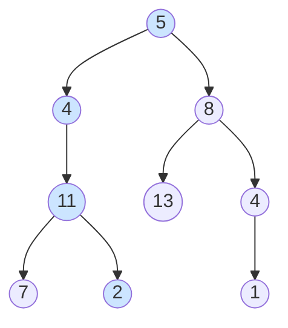
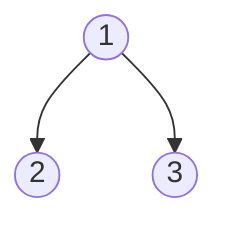
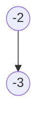

# Path Sum

**Date added:** 2026-06-13

## Problem Description

Given the root of a binary tree and an integer `targetSum`, return `true` if the tree has a
root-to-leaf path such that adding up all the values along the path equals `targetSum`.

A leaf is a node with no children.

**Source:** https://leetcode.com/problems/path-sum/description/

## Examples

**Example 1**
```
Input: root = [5,4,8,11,null,13,4,7,2,null,null,null,1], targetSum = 22
Output: true
Explanation: The path 5 → 4 → 11 → 2 sums to 22.
```



**Example 2**
```
Input: root = [1,2,3], targetSum = 5
Output: false
Explanation: The two root-to-leaf paths are (1→2)=3 and (1→3)=4; neither equals 5.
```



**Example 3**
```
Input: root = [], targetSum = 0
Output: false
Explanation: An empty tree has no root-to-leaf paths.
```

**Example 4**
```
Input: root = [1], targetSum = 1
Output: true
Explanation: The single node is both root and leaf; its value equals targetSum.
```


**Example 5**
```
Input: root = [-2, null, -3], targetSum = -5
Output: true
Explanation: The path -2 → -3 sums to -5.
```



## Constraints

- The number of nodes in the tree is in the range `[0, 5000]`.
- `-1000 <= Node.val <= 1000`
- `-1000 <= targetSum <= 1000`

## Hints

1. Think about what changes as you move from the root down to a leaf — what quantity are you tracking?
2. At each node, you can reduce the problem: instead of asking "does a path from here sum to T?", ask "does a path from here sum to T minus the current node's value?"
3. What is the base case when you reach a leaf node?
4. Recursion naturally mirrors the tree structure — each call handles one node and delegates to its children.
5. Be careful with null nodes: a null child is not a leaf, so reaching null should not count as a valid path end.
