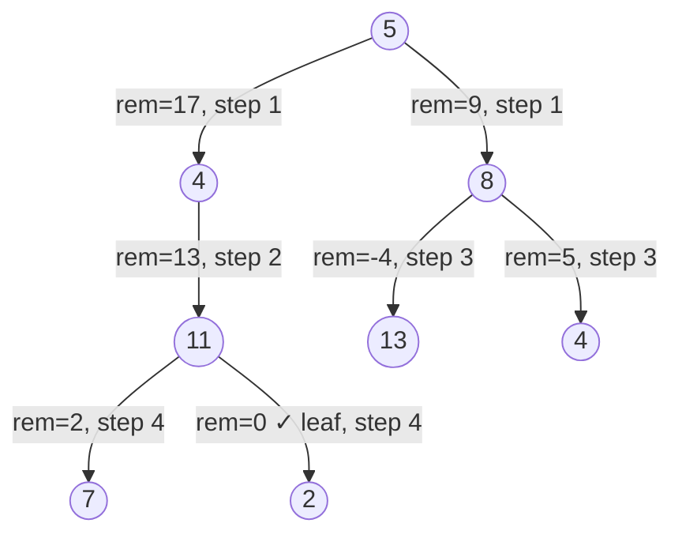

# Path Sum — Review

| | |
|---|---|
| **Solved on** | 2026-06-13 |
| **DSA Category** | Trees |

---

## 1. Your Solution Assessment

**Correctness:** Solid. Null root is handled, the leaf check is correct (both children null), and the accumulated sum is compared at leaf nodes only. Skipping null children explicitly avoids recursing into non-existent paths, which is correct.

**Code quality:** The three-method split (`dfs` → `dfsHelper` → `isLeaf`) adds more ceremony than this problem warrants. `dfs` does nothing beyond a null check that `dfsHelper` could own. The accumulation-forward style (building `sum` up from 0) works, but the subtraction style (decrementing `targetSum` as you descend) is idiomatic for this problem and collapses everything into one method.

**Time complexity: O(n)** — every node is visited exactly once.

**Space complexity: O(h)** — the call stack reaches at most the height of the tree. O(log n) for a balanced tree; O(n) worst case for a fully skewed tree.

**Algorithm trace** — Input: `root = [5,4,8,11,null,13,4,7,2,null,null,null,1]`, `targetSum = 22`

Tree path traced: 5 → 4 → 11 → {7, 2}

| Depth | Call | sum | isLeaf? | Returns |
|-------|------|-----|---------|---------|
| 0 | dfsHelper(5, 22, 0) | 5 | No | left \|\| right |
| 1 | dfsHelper(4, 22, 5) | 9 | No | left \|\| right |
| 2 | dfsHelper(11, 22, 9) | 20 | No | left \|\| right |
| 3 | dfsHelper(7, 22, 20) | 27 | **Yes** | 22==27 → false |
| 3 | dfsHelper(2, 22, 20) | 22 | **Yes** | 22==22 → **true** |
| 2 | (11) | — | — | false \|\| true → **true** |
| 1 | (4) | — | — | **true** (short-circuits) |
| 0 | (5) | — | — | **true** |

→ return `true`

---

## 2. Optimal Approach

Subtract the current node's value from `targetSum` at each step. At a leaf, you need `targetSum` to equal the node's value — equivalently, `targetSum - node.val == 0`. This removes the need for any helper or accumulator variable and keeps the entire logic in one method.

**Time complexity: O(n)** — each node visited once.
**Space complexity: O(h)** — recursion depth equals tree height.

```java
public boolean hasPathSum(TreeNode root, int targetSum) {
    if (root == null) return false;
    if (root.left == null && root.right == null) return root.val == targetSum;
    return hasPathSum(root.left, targetSum - root.val)
        || hasPathSum(root.right, targetSum - root.val);
}
```

**Algorithm trace** — Input: same tree, `targetSum = 22`

| Depth | Call | targetSum | isLeaf? | Returns |
|-------|------|-----------|---------|---------|
| 0 | hasPathSum(5, 22) | 22 | No | left(17) \|\| right(17) |
| 1 | hasPathSum(4, 17) | 17 | No | left(13) \|\| right(13) |
| 2 | hasPathSum(11, 13) | 13 | No | left(2) \|\| right(2) |
| 3 | hasPathSum(7, 2) | 2 | **Yes** | 7==2 → false |
| 3 | hasPathSum(2, 2) | 2 | **Yes** | 2==2 → **true** |
| 2 | (11) | — | — | **true** |
| 1 | (4) | — | — | **true** |
| 0 | (5) | — | — | **true** |

→ return `true`

---

## 3. Alternative Approaches

### BFS with paired queues

Use two queues in lockstep: one for nodes to visit, one for the remaining sum at each node. When you dequeue a leaf whose remaining sum is 0, a valid path exists.

**Time complexity: O(n)** — every node is enqueued and dequeued once.
**Space complexity: O(w)** — the queues hold at most one full level at a time, where w is the maximum width.

```java
public boolean hasPathSum(TreeNode root, int targetSum) {
    if (root == null) return false;

    Queue<TreeNode> nodes = new LinkedList<>();
    Queue<Integer> remaining = new LinkedList<>();

    nodes.offer(root);
    remaining.offer(targetSum - root.val);

    while (!nodes.isEmpty()) {
        TreeNode node = nodes.poll();
        int rem = remaining.poll();

        if (node.left == null && node.right == null && rem == 0) return true;

        if (node.left != null) {
            nodes.offer(node.left);
            remaining.offer(rem - node.left.val);
        }

        if (node.right != null) {
            nodes.offer(node.right);
            remaining.offer(rem - node.right.val);
        }
    }

    return false;
}
```

**Algorithm trace** — Input: same tree, `targetSum = 22`



→ At step 4, dequeue node 2 with rem=0 and it is a leaf → return `true`

---

### Brute force — enumerate all root-to-leaf paths

Collect every root-to-leaf path as a list, sum each one, and check against `targetSum`.

**Time complexity: O(n²)** — O(n) paths, each up to O(n) long to copy.
**Space complexity: O(n·h)** — storing all paths simultaneously.

Acceptable only under extreme time pressure when you cannot recall the recursive approach.

**Algorithm trace** — Input: simplified tree `[1, 2, 3]`, `targetSum = 3`

| Depth | Call | path so far | isLeaf? | action |
|-------|------|-------------|---------|--------|
| 0 | collect(1, []) | [1] | No | recurse left+right |
| 1 | collect(2, [1]) | [1,2] | **Yes** | sum=3==3 → found |
| 1 | collect(3, [1]) | [1,3] | **Yes** | sum=4≠3 |

→ return `true`
