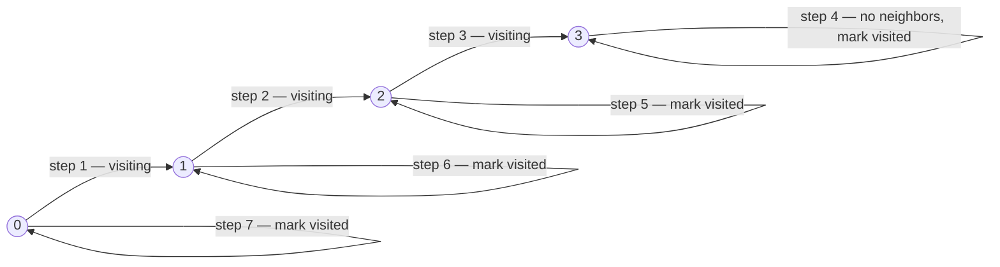
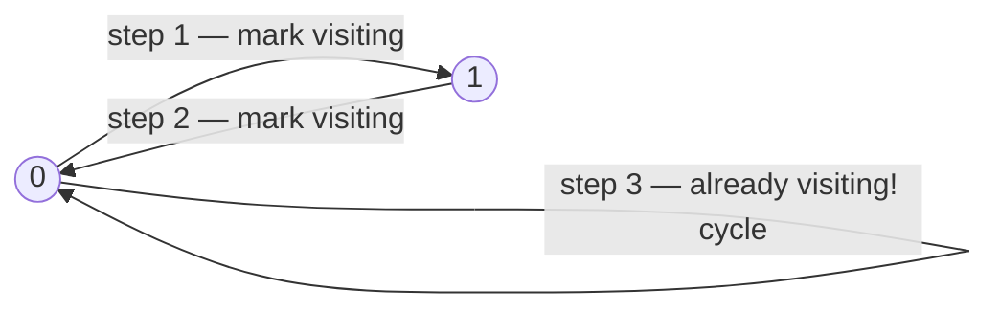

# Course Schedule — Review

| | |
|---|---|
| **Solved on** | 2026-06-14 |
| **DSA Category** | Graphs |

---

## 1. Your Solution Assessment

### Correctness
The solution is correct. The three-state DFS approach (`'\0'` → unvisited, `'*'` → on the current stack, `'v'` → fully processed) is the standard cycle-detection pattern, and you applied it accurately. The critical fix from your earlier bug — moving `visited[visiting] = 'v'` to *after* the recursive calls rather than leaving it missing — is exactly right. Without that line, nodes would be re-explored on every DFS call from a different entry point, causing false negatives for acyclic graphs.

One subtle correctness note: `buildGraph` returns `Map.of()` (an empty immutable map) when there are no prerequisites, but the outer loop in `canFinish` iterates over `prerequisites` (the array), not the map's keys. When `prerequisites` is empty the loop body never executes, so `graph.get(visiting)` is never called on the empty map — this avoids a `NullPointerException`. It works, but it is a fragile dependency between the two methods.

### Code Quality
- **Naming**: `visiting` as the parameter name for the current node being processed is clear and communicates the three-state intent well.
- **`buildGraph` early return**: Returning `Map.of()` for the no-prerequisites case makes `buildGraph`'s contract inconsistent — it normally returns a map with all `numCourses` nodes, but in this branch it returns an empty map.
- **Entry-point iteration**: Iterating over `prerequisites` to choose DFS starting nodes works, but only starts DFS from nodes that appear as a dependent. Iterating over all `numCourses` nodes is the more conventional and self-documenting pattern.

### Time Complexity — O(V + E)
Each node is fully processed at most once (the `'v'` check short-circuits re-entry), and each edge is traversed at most once. `V = numCourses`, `E = prerequisites.length`.

### Space Complexity — O(V + E)
Adjacency list: O(E). `visited` array: O(V). DFS call stack: at most O(V) deep in the worst case.

**Algorithm trace** — Input: `numCourses = 4, prerequisites = [[1,0],[2,1],[3,2]]`

Graph: 0→1→2→3 (linear chain, no cycle)



No back edge encountered → return `true`

---

## 2. Optimal Approach

**DFS cycle detection with three states** — exactly what you implemented. This is the canonical optimal solution.

Build a directed adjacency list from the prerequisites. For each unvisited node, run DFS. Use three states per node:
- Unvisited (`0`) — not yet explored.
- Visiting (`1`) — currently on the DFS call stack.
- Visited (`2`) — fully explored, confirmed cycle-free.

If DFS reaches a node in the *Visiting* state, a back edge exists — a cycle — return `false`. After fully exploring a node, mark it *Visited* so it is never re-processed.

**Time:** O(V + E) — each node and edge processed once.
**Space:** O(V + E) — adjacency list + state array + call stack.

```java
public boolean canFinish(int numCourses, int[][] prerequisites) {
    List<List<Integer>> adj = new ArrayList<>();
    for (int i = 0; i < numCourses; i++) adj.add(new ArrayList<>());
    for (int[] p : prerequisites) adj.get(p[0]).add(p[1]);

    int[] state = new int[numCourses]; // 0=unvisited, 1=visiting, 2=visited

    for (int i = 0; i < numCourses; i++) {
        if (state[i] == 0 && hasCycle(adj, state, i)) return false;
    }
    return true;
}

private boolean hasCycle(List<List<Integer>> adj, int[] state, int node) {
    state[node] = 1;
    for (int neighbor : adj.get(node)) {
        if (state[neighbor] == 1) return true;
        if (state[neighbor] == 0 && hasCycle(adj, state, neighbor)) return true;
    }
    state[node] = 2;
    return false;
}
```

**Algorithm trace** — Input: `numCourses = 2, prerequisites = [[1,0],[0,1]]` (cycle)

Graph: 0→1, 1→0



→ back edge detected → return `false`

---

## 3. Alternative Approaches

### Topological Sort — Kahn's Algorithm (BFS / in-degree)

Build the adjacency list and compute each node's in-degree. Enqueue all nodes with in-degree 0. Process the queue: for each dequeued node, decrement the in-degree of its neighbors; enqueue any that reach 0. If the total count of processed nodes equals `numCourses`, the graph is acyclic.

**Time:** O(V + E) — same as DFS.
**Space:** O(V + E) — adjacency list + in-degree array + queue.
**When to use:** Preferred when you want an iterative solution with no recursion depth concern, or when you need the actual topological order (not just cycle detection).

```java
public boolean canFinish(int numCourses, int[][] prerequisites) {
    List<List<Integer>> graph = new ArrayList<>();
    int[] indeg = new int[numCourses];
    for (int i = 0; i < numCourses; i++) graph.add(new ArrayList<>());
    for (int[] p : prerequisites) {
        graph.get(p[1]).add(p[0]);
        indeg[p[0]]++;
    }

    Queue<Integer> queue = new LinkedList<>();
    for (int i = 0; i < numCourses; i++) if (indeg[i] == 0) queue.offer(i);

    int processed = 0;
    while (!queue.isEmpty()) {
        int node = queue.poll();
        processed++;
        for (int next : graph.get(node)) {
            if (--indeg[next] == 0) queue.offer(next);
        }
    }
    return processed == numCourses;
}
```

**Algorithm trace** — Input: `numCourses = 4, prerequisites = [[1,0],[2,1],[3,2]]`

inDegree: `[0, 1, 1, 1]`. Initial queue: `[0]`

| step | dequeue | processed | neighbors | inDegree after | enqueue |
|------|---------|-----------|-----------|----------------|---------|
| 1 | 0 | 1 | {1} → indeg[1]=0 | [0,0,1,1] | 1 |
| 2 | 1 | 2 | {2} → indeg[2]=0 | [0,0,0,1] | 2 |
| 3 | 2 | 3 | {3} → indeg[3]=0 | [0,0,0,0] | 3 |
| 4 | 3 | 4 | {} | | |

processed=4 == numCourses=4 → return `true`

---

### Brute-Force DFS (no visited memoization)

Run DFS from every node, tracking only the current path. No "fully visited" state — re-explore nodes on every new DFS call.

**Time:** O(V · (V + E)) — each node re-explored for every starting point.
**Space:** O(V) — path tracking only.
**When to use:** Only acceptable in interviews under extreme time pressure with very small inputs; never in production.

**Algorithm trace** — Input: `numCourses = 3, prerequisites = [[0,1],[1,2],[2,0]]` (cycle)

| start | DFS path | cycle found? |
|-------|----------|-------------|
| 0 | 0 → 1 → 2 → 0 (0 already in path) | **Yes** → return false |
