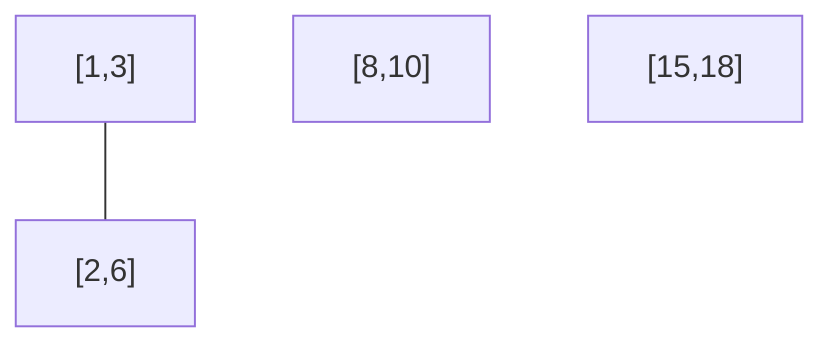

# Merge Intervals — Review

| | |
|---|---|
| **Solved on** | 2026-06-16 |
| **DSA Category** | Intervals |

---

## Addressing Your Comments

**Line 33 — "Is this a pointer or a copy?"**

Your assumption is correct: `last` is a reference (pointer), not a copy.

In Java, `int[]` is an object. `List<int[]>` stores references to those objects. When you call `merged.get(merged.size() - 1)`, you get back the same reference that's already in the list — no copy is made. So when you later do `last[1] = Math.max(...)`, you are mutating the `int[]` object in-place, which is exactly what the list sees. Your solution relies on this behavior and it works correctly.

The only time you'd get a copy is if you did something like `int[] last = last.clone()` or
`Arrays.copyOf(...)`. Plain assignment of a reference type never copies.

---

## 1. Your Solution Assessment

**Correctness:** Correct. Sorting by start, then doing a single left-to-right scan with `current[0] <= last[1]` properly handles all cases — overlapping, touching (`[1,4]` + `[4,5]`), and fully-contained intervals (because `Math.max` picks the larger end).

One minor note: the null check (`intervals == null`) is a good defensive habit, but the problem constraints guarantee `1 <= intervals.length`, so null can never arrive per the spec. No harm in keeping it.

**Code quality:** Clear and readable. `current`, `last`, and `merged` are well-chosen names. The comparator is explicit and correct.

**Time complexity: O(n log n)**
The sort dominates. The subsequent loop is O(n).

**Space complexity: O(n)**
The `merged` list holds at most n intervals (output space). The sort uses O(log n) stack space internally.

**Algorithm trace** — Input: `intervals = [[1,3],[2,6],[8,10],[15,18]]`

(already sorted by start)

| i | current | last (top of merged) | current[0] <= last[1]? | action | merged |
|---|---------|----------------------|------------------------|--------|--------|
| init | — | — | — | merged.add([1,3]) | [[1,3]] |
| 1 | [2,6] | [1,3] | 2 <= 3 ✓ | last[1] = max(3,6) = 6 | [[1,6]] |
| 2 | [8,10] | [1,6] | 8 <= 6 ✗ | merged.add([8,10]) | [[1,6],[8,10]] |
| 3 | [15,18] | [8,10] | 15 <= 10 ✗ | merged.add([15,18]) | [[1,6],[8,10],[15,18]] |

→ return `[[1,6],[8,10],[15,18]]`

---

## 2. Optimal Approach

Sort by start value, then do one linear pass comparing each interval against the last merged one.
This is exactly what you implemented — your solution is already optimal.

**Time: O(n log n)** — sort dominates.
**Space: O(n)** — output list.

```java
public int[][] merge(int[][] intervals) {
    Arrays.sort(intervals, Comparator.comparingInt(a -> a[0]));

    List<int[]> merged = new ArrayList<>();
    merged.add(intervals[0]);

    for (int i = 1; i < intervals.length; i++) {
        int[] current = intervals[i];
        int[] last = merged.get(merged.size() - 1);

        if (current[0] <= last[1]) {
            last[1] = Math.max(last[1], current[1]);
        } else {
            merged.add(current);
        }
    }

    return merged.toArray(new int[0][]);
}
```

**Algorithm trace** — same as above: `intervals = [[1,3],[2,6],[8,10],[15,18]]`

| i | current | last | overlap? | merged |
|---|---------|------|----------|--------|
| 1 | [2,6] | [1,3] | Yes | [[1,6]] |
| 2 | [8,10] | [1,6] | No | [[1,6],[8,10]] |
| 3 | [15,18] | [8,10] | No | [[1,6],[8,10],[15,18]] |

→ return `[[1,6],[8,10],[15,18]]`

---

## 3. Alternative Approaches

### Brute Force — O(n²) time, O(n) space

For each interval, scan all others to find overlaps and merge them. Repeat until no merges occur.

- **Time: O(n²)** — nested scan over all pairs each pass.
- **Space: O(n)** — output list.
- **When acceptable:** Only for very small inputs or a quick sketch during an interview — never in production.

**Algorithm trace** — Input: `intervals = [[1,4],[2,3]]`

| pass | i | j | overlap? | action |
|------|---|---|----------|--------|
| 1 | 0 ([1,4]) | 1 ([2,3]) | 2<=4 → yes | merge into [1,4] |
| 2 | — | — | no more overlaps found | stop |

→ return `[[1,4]]`

---

### Graph / Connected Components — O(n²) time, O(n²) space

Build a graph where two intervals share an edge if they overlap. Find connected components (BFS/DFS) and take the min start / max end of each component.

- **Time: O(n²)** — building the adjacency list requires comparing all pairs.
- **Space: O(n²)** — adjacency list.
- **When acceptable:** Never preferred. Interesting as a thought exercise but strictly worse than the sort-and-scan approach on every axis.

**Algorithm trace** — Input: `intervals = [[1,3],[2,6],[8,10],[15,18]]`



Connected components: `{[1,3],[2,6]}`, `{[8,10]}`, `{[15,18]}`

→ merge each component: `[[1,6], [8,10], [15,18]]`
