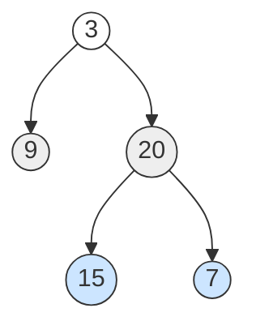

# Binary Tree Level Order Traversal

**Date added:** 2026-06-16

## Problem Description

Given the root of a binary tree, return the level order traversal of its nodes' values
(i.e., from left to right, level by level). Each level's values are grouped into their own
sublist.

**Source:** https://leetcode.com/problems/binary-tree-level-order-traversal/

## Examples

**Example 1**



```
Input: root = [3,9,20,null,null,15,7]
Output: [[3],[9,20],[15,7]]
Explanation: Level 0 has [3], level 1 has [9,20], level 2 has [15,7].
```

**Example 2**

```mermaid
graph TD
    A((1))

    style A fill:#fff,stroke:#333
```



```
Input: root = [1]
Output: [[1]]
Explanation: The tree has a single node; the output is one level containing just that node.
```

**Example 3**

```
Input: root = []
Output: []
Explanation: An empty tree produces an empty list.
```

## Constraints

- The number of nodes in the tree is in the range `[0, 2000]`.
- `-1000 <= Node.val <= 1000`

## Hints

1. How would you visit every node level by level? What data structure naturally processes elements in the order they were added?
2. A queue gives you FIFO ordering — nodes enqueued first come out first, which matches left-to-right, top-to-bottom traversal.
3. At the start of each iteration, the queue holds exactly all nodes at the current level. How can you use the queue's current size to know when one level ends and the next begins?
4. For each node you dequeue, add its children (left then right) to the back of the queue — they'll be processed in the next level's iteration.
5. Collect each level's values into a sublist, then append that sublist to the result before moving on to the next level.
