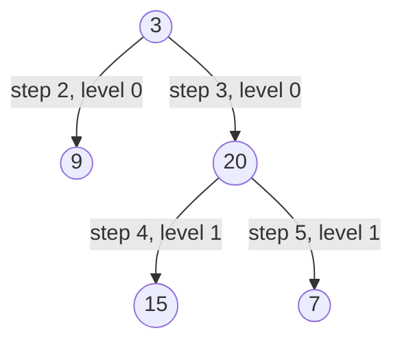
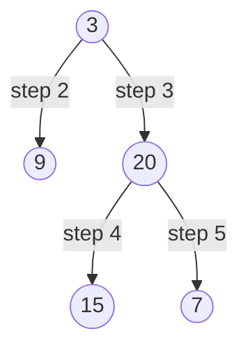
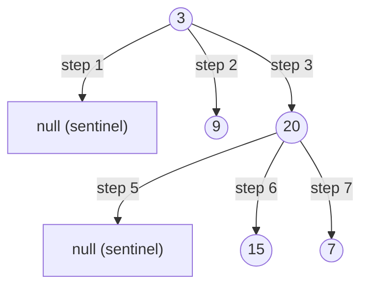

# Binary Tree Level Order Traversal — Review

| | |
|---|---|
| **Solved on** | 2026-06-16 |
| **DSA Category** | Trees |

---

## 1. Your Solution Assessment

**Correctness:** The solution handles all cases correctly — null root returns an empty list, the level-size snapshot (`int levelSize = queue.size()`) ensures the inner loop processes exactly the current level without bleeding into the next, and both children are enqueued in left-to-right order. All constraints are satisfied.

**Code quality:** Clean and easy to follow. Variable names (`traversal`, `level`, `current`, `levelSize`) communicate intent clearly. Blank line between `level.add` and the child-enqueue block is a nice visual separation of concerns within the inner loop.

**Time complexity: O(n)** — every node is enqueued once and dequeued once, so the total work is linear in the number of nodes.

**Space complexity: O(n)** — the queue holds at most one full level at a time. For a complete binary tree, the bottom level can contain up to n/2 nodes, which is O(n). The output list itself also holds all n values.

**Algorithm trace** — Input: `root = [3,9,20,null,null,15,7]`

```
        3
       / \
      9   20
         /  \
        15    7
```



Level snapshots: `[[3]]` → `[[3],[9,20]]` → `[[3],[9,20],[15,7]]`

→ return `[[3],[9,20],[15,7]]`

---

## 2. Optimal Approach

**BFS with level-size snapshot** — exactly what you implemented. The key insight is that at the start of each outer-loop iteration, the queue contains precisely all nodes at the current level. Capturing `queue.size()` before the inner loop gives you the exact count to drain, so you can process one level at a time without a sentinel or extra data structure.

- **Time:** O(n) — each node is visited once.
- **Space:** O(n) — queue at peak holds the widest level (up to n/2 nodes for a complete tree).

```java
public List<List<Integer>> levelOrder(TreeNode root) {
    if (root == null) return List.of();

    List<List<Integer>> traversal = new ArrayList<>();
    Deque<TreeNode> queue = new ArrayDeque<>();
    queue.offer(root);

    while (!queue.isEmpty()) {
        int levelSize = queue.size();
        List<Integer> level = new ArrayList<>();

        while (levelSize-- > 0) {
            TreeNode current = queue.poll();
            level.add(current.val);
            if (current.left != null)  queue.offer(current.left);
            if (current.right != null) queue.offer(current.right);
        }

        traversal.add(level);
    }

    return traversal;
}
```

**Algorithm trace** — same input: `root = [3,9,20,null,null,15,7]`



→ return `[[3],[9,20],[15,7]]`

---

## 3. Alternative Approaches

### DFS with depth tracking

Perform a preorder DFS, passing the current depth as a parameter. When visiting a node at depth `d`, append its value to `result.get(d)`, creating a new sublist first if `d == result.size()`.

- **Time:** O(n) — every node visited once.
- **Space:** O(h) for the call stack, where h is the tree height. Best case O(log n) for a balanced tree, worst case O(n) for a skewed tree. Output is still O(n).
- **When acceptable:** When you want to avoid an explicit queue and are comfortable with recursion. Slightly more code to manage the depth index.

```java
public List<List<Integer>> levelOrder(TreeNode root) {
    List<List<Integer>> result = new ArrayList<>();
    dfs(root, 0, result);
    return result;
}

private void dfs(TreeNode node, int depth, List<List<Integer>> result) {
    if (node == null) return;
    if (depth == result.size()) result.add(new ArrayList<>());
    result.get(depth).add(node.val);
    dfs(node.left,  depth + 1, result);
    dfs(node.right, depth + 1, result);
}
```

**Algorithm trace** — Input: `root = [3,9,20,null,null,15,7]`

| Depth | Call | depth | result.size() | action |
|-------|------|-------|---------------|--------|
| 0 | dfs(3, 0) | 0 | 0 | new sublist, add 3 → [[3]] |
| 1 | dfs(9, 1) | 1 | 1 | new sublist, add 9 → [[3],[9]] |
| 1 | dfs(20, 1) | 1 | 2 | add 20 → [[3],[9,20]] |
| 2 | dfs(15, 2) | 2 | 2 | new sublist, add 15 → [[3],[9,20],[15]] |
| 2 | dfs(7, 2) | 2 | 3 | add 7 → [[3],[9,20],[15,7]] |

→ return `[[3],[9,20],[15,7]]`

---

### BFS with null sentinel

Enqueue `null` as a level separator. Each time you dequeue `null`, the current level is complete — flush it and enqueue another `null` if the queue is non-empty.

- **Time:** O(n).
- **Space:** O(n).
- **When acceptable:** Occasionally seen in older code or interview answers, but the level-size snapshot (your approach) is cleaner and less error-prone — it's easy to introduce an infinite loop with sentinels if you forget the non-empty guard.

**Algorithm trace** — Input: `root = [3,9,20,null,null,15,7]`



Queue evolution: `[3]` → `[null]` (flush level 0) → `[9,20,null]` → `[20,null]` → `[null,15,7]` (flush level 1) → `[15,7]` → drain (flush level 2)

→ return `[[3],[9,20],[15,7]]`
