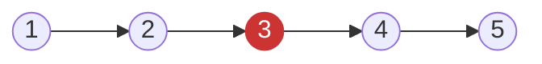
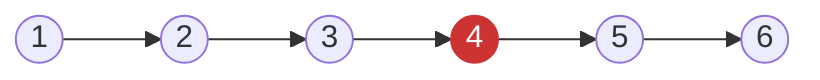

# Middle of the Linked List

**Date added:** 2026-06-30

## Problem Description

Given the head of a singly linked list, return the middle node of the linked list.

If there are two middle nodes, return the second middle node.

**Source:** https://leetcode.com/problems/middle-of-the-linked-list/

## Examples

**Example 1**



```
Input: head = [1,2,3,4,5]
Output: [3,4,5]
Explanation: The middle node of the list is node 3.
```

**Example 2**



```
Input: head = [1,2,3,4,5,6]
Output: [4,5,6]
Explanation: Since the list has two middle nodes with values 3 and 4, we return the second one.
```

## Constraints

- The number of nodes in the list is in the range `[1, 100]`.
- `1 <= Node.val <= 100`

## Hints

1. The most straightforward approach is to collect all nodes into an array — how does that let you find the middle?
2. Can you do it without storing all nodes? Think about what you'd need to know while traversing.
3. What if one pointer moved twice as fast as another through the list?
4. When the fast pointer reaches the end, where is the slow pointer?
5. For even-length lists, verify your pointers land on the *second* middle node, not the first.
