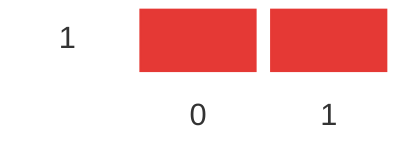
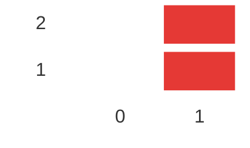

# Container With Most Water

**Date added:** 2026-07-02

## Problem Description

You are given an integer array `height` of length `n`. There are `n` vertical lines drawn
such that the two endpoints of the `i`th line are `(i, 0)` and `(i, height[i])`.

Find two lines that together with the x-axis form a container, such that the container
contains the most water. Return the maximum amount of water a container can store.

Notice that you may not slant the container.

**Source:** https://leetcode.com/problems/container-with-most-water/

## Examples

**Example 1**
```
Input: height = [1,8,6,2,5,4,8,3,7]
Output: 49
Explanation: Lines at index 1 (height 8) and index 8 (height 7) form the container.
width = 8 - 1 = 7, bounded height = min(8, 7) = 7, area = 7 * 7 = 49.
```



```mermaid
block-beta
  columns 10
  y1["8"] space b2[" "] space space space space b3[" "] space space
  y4["7"] space b5[" "] b6[" "] b7[" "] b8[" "] b9[" "] b10[" "] b11[" "] b12[" "]
  y13["6"] space b14[" "] b15[" "] b16[" "] b17[" "] b18[" "] b19[" "] b20[" "] b21[" "]
  y22["5"] space b23[" "] b24[" "] b25[" "] b26[" "] b27[" "] b28[" "] b29[" "] b30[" "]
  y31["4"] space b32[" "] b33[" "] b34[" "] b35[" "] b36[" "] b37[" "] b38[" "] b39[" "]
  y40["3"] space b41[" "] b42[" "] b43[" "] b44[" "] b45[" "] b46[" "] b47[" "] b48[" "]
  y49["2"] space b50[" "] b51[" "] b52[" "] b53[" "] b54[" "] b55[" "] b56[" "] b57[" "]
  y58["1"] b59[" "] b60[" "] b61[" "] b62[" "] b63[" "] b64[" "] b65[" "] b66[" "] b67[" "]
  x68[" "] x69["0"] x70["1"] x71["2"] x72["3"] x73["4"] x74["5"] x75["6"] x76["7"] x77["8"]

  class b2,b5,b12,b14,b21,b23,b30,b32,b39,b41,b48,b50,b57,b60,b67 red
  class b3,b10,b15,b19,b24,b26,b28,b33,b35,b36,b37,b42,b44,b45,b46,b47,b51,b52,b53,b54,b55,b56,b59,b61,b62,b63,b64,b65,b66 black
  class b6,b7,b8,b9,b11,b16,b17,b18,b20,b25,b27,b29,b34,b38,b43 blue
  class y1,y4,y13,y22,y31,y40,y49,y58,x68,x69,x70,x71,x72,x73,x74,x75,x76,x77 axis

  classDef red fill:#e53935,stroke:#e53935,width:60px;
  classDef blue fill:#90caf9,stroke:#90caf9,width:60px;
  classDef black fill:#111111,stroke:#111111,width:60px;
  classDef axis fill:none,stroke:none;
```

The red columns (index 1, height 8, and index 8, height 7) are the chosen lines. The blue
region is the trapped water, bounded above by `min(8, 7) = 7` and spanning the columns
between the two red lines. Note the black bar at index 6 (height 8) pokes above the water
line — it doesn't add area since the container's height is capped by its *shorter* wall.

**Example 2**
```
Input: height = [1,1]
Output: 1
Explanation: Only one pair of lines exists. width = 1, height = min(1, 1) = 1, area = 1.
```



**Example 3**
```
Input: height = [4,3,2,1,4]
Output: 16
Explanation: Lines at index 0 (height 4) and index 4 (height 4) form the widest possible
container. width = 4 - 0 = 4, height = min(4, 4) = 4, area = 16.
```



```mermaid
block-beta
  columns 6
  y1["4"] b2[" "] b3[" "] b4[" "] b5[" "] b6[" "]
  y7["3"] b8[" "] b9[" "] b10[" "] b11[" "] b12[" "]
  y13["2"] b14[" "] b15[" "] b16[" "] b17[" "] b18[" "]
  y19["1"] b20[" "] b21[" "] b22[" "] b23[" "] b24[" "]
  x25[" "] x26["0"] x27["1"] x28["2"] x29["3"] x30["4"]

  class b2,b6,b8,b12,b14,b18,b20,b24 red
  class b9,b15,b16,b21,b22,b23 black
  class b3,b4,b5,b10,b11,b17 blue
  class y1,y7,y13,y19,x25,x26,x27,x28,x29,x30 axis

  classDef red fill:#e53935,stroke:#e53935,width:60px;
  classDef blue fill:#90caf9,stroke:#90caf9,width:60px;
  classDef black fill:#111111,stroke:#111111,width:60px;
  classDef axis fill:none,stroke:none;
```

**Example 4**
```
Input: height = [1,2,1]
Output: 2
Explanation: Lines at index 0 (height 1) and index 2 (height 1) give width = 2,
height = min(1, 1) = 1, area = 2 — which beats using index 1 with either neighbor.
```



```mermaid
block-beta
  columns 4
  y1["2"] space b2[" "] space
  y3["1"] b4[" "] b5[" "] b6[" "]
  x7[" "] x8["0"] x9["1"] x10["2"]

  class b4,b6 red
  class b2,b5 black
  class y1,y3,x7,x8,x9,x10 axis

  classDef red fill:#e53935,stroke:#e53935,width:60px;
  classDef black fill:#111111,stroke:#111111,width:60px;
  classDef axis fill:none,stroke:none;
```

**Example 5**
```
Input: height = [0,2]
Output: 0
Explanation: The only pair available has one line of height 0, so no water can be trapped:
height = min(0, 2) = 0, area = 0.
```



## Constraints

- `n == height.length`
- `2 <= n <= 10^5`
- `0 <= height[i] <= 10^4`

## Hints

1. A brute-force approach checks every pair of lines — that's O(n^2). Can you do better?
2. The area of a container is limited by its *shorter* line. Moving the pointer at the taller
   line inward can never increase the area, since the width shrinks and the height is capped
   by the same (or a smaller) minimum.
3. Start with the widest possible container: the leftmost and rightmost lines. This guarantees
   the maximum width to begin with.
4. At each step, which pointer should move — the one at the shorter line, or the taller one?
   Only moving the shorter line's pointer has a chance of finding a taller boundary and thus a
   larger area.
5. Track the best area seen so far while moving the two pointers toward each other until they
   meet. This yields an O(n) single-pass two-pointer solution.
