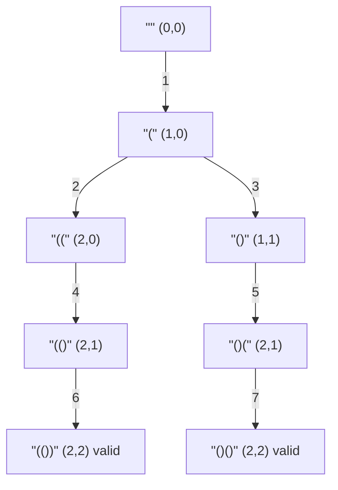

| | |
|---|---|
| **Solved on** | 2026-08-22 |
| **DSA Category** | Backtracking |

## 1. Your Solution Assessment

**Correctness:** Correct. All 6 tests pass, including the boundary case `n = 8` (1430 combinations, each verified well-formed). The recursion tracks `openingCount` and `closingCount`, only allows an opening parenthesis while `openingCount < n`, and only allows a closing parenthesis while `closingCount < openingCount` — this is exactly the invariant that guarantees every generated string is balanced at every prefix, not just at the end. The base case (`openingCount == n && closingCount == openingCount`) is reached only when the string is complete and valid, so nothing invalid ever gets recorded and nothing valid is ever skipped.

**Code quality:** Clean and readable — the parameter names (`openingCount`, `closingCount`, `combination`) make the invariant self-documenting, and the `append` / recurse / `deleteCharAt` pattern is the correct idiom for backtracking with a mutable `StringBuilder` (avoids allocating a new string at every node). Two things worth tightening:
- `backtracking` has default (package-private) access. It's an internal implementation detail of `generateParenthesis`, not part of the class's API, so it should be `private`.
- It also doesn't touch any instance state, so it can be `static`.

**Time complexity:** O(4ⁿ / √n). The number of valid combinations generated is the *n*th Catalan number, Cₙ = C(2n, n) / (n + 1), which grows as Θ(4ⁿ / n^1.5). Building/copying each finished string costs O(n), and the pruned branches (rejected before recursing) contribute only a constant factor on top — so the total work is bounded by O(n · Cₙ), commonly simplified to O(4ⁿ / √n).

**Space complexity:** O(n) auxiliary, for the recursion call stack depth and the shared `StringBuilder` (both bounded by the final string length, 2n), plus O(n · 4ⁿ / √n) to store the output itself (n characters × Cₙ strings) if you count the result list.

**Algorithm trace** (nested backtracking notation) — `n = 3`, matching the example from the problem statement:

```
Legend: ADD = try a character and recurse · RECORD = base case, add to output · REMOVE = undo (backtrack)

ADD ( -> "(" (open=1, close=0)
  ADD ( -> "((" (open=2, close=0)
    ADD ( -> "(((" (open=3, close=0)
      ADD ) -> "((()" (open=3, close=1)
        ADD ) -> "((())" (open=3, close=2)
          ADD ) -> "((()))" (open=3, close=3)
          RECORD "((()))" -> added to output
          REMOVE ) -> "((())" (open=3, close=2)
        REMOVE ) -> "((()" (open=3, close=1)
      REMOVE ) -> "(((" (open=3, close=0)
    REMOVE ( -> "((" (open=2, close=0)
    ADD ) -> "(()" (open=2, close=1)
      ADD ( -> "(()(" (open=3, close=1)
        ADD ) -> "(()()" (open=3, close=2)
          ADD ) -> "(()())" (open=3, close=3)
          RECORD "(()())" -> added to output
          REMOVE ) -> "(()()" (open=3, close=2)
        REMOVE ) -> "(()(" (open=3, close=1)
      REMOVE ( -> "(()" (open=2, close=1)
      ADD ) -> "(())" (open=2, close=2)
        ADD ( -> "(())(" (open=3, close=2)
          ADD ) -> "(())()" (open=3, close=3)
          RECORD "(())()" -> added to output
          REMOVE ) -> "(())(" (open=3, close=2)
        REMOVE ( -> "(())" (open=2, close=2)
      REMOVE ) -> "(()" (open=2, close=1)
    REMOVE ) -> "((" (open=2, close=0)
  REMOVE ( -> "(" (open=1, close=0)
  ADD ) -> "()" (open=1, close=1)
    ADD ( -> "()(" (open=2, close=1)
      ADD ( -> "()((" (open=3, close=1)
        ADD ) -> "()(()" (open=3, close=2)
          ADD ) -> "()(())" (open=3, close=3)
          RECORD "()(())" -> added to output
          REMOVE ) -> "()(()" (open=3, close=2)
        REMOVE ) -> "()((" (open=3, close=1)
      REMOVE ( -> "()(" (open=2, close=1)
      ADD ) -> "()()" (open=2, close=2)
        ADD ( -> "()()(" (open=3, close=2)
          ADD ) -> "()()()" (open=3, close=3)
          RECORD "()()()" -> added to output
          REMOVE ) -> "()()(" (open=3, close=2)
        REMOVE ( -> "()()" (open=2, close=2)
      REMOVE ) -> "()(" (open=2, close=1)
    REMOVE ( -> "()" (open=1, close=1)
  REMOVE ) -> "(" (open=1, close=0)
REMOVE ( -> "" (open=0, close=0)
```
→ output: `["((()))", "(()())", "(())()", "()(())", "()()()"]` (order matches Example 1 in the problem statement)

**Improved, more idiomatic version of your implementation.** The algorithm and complexity are already optimal — this only tightens the code style:

```java
package mx.jovannypcg.base.p56_generateparentheses;

import java.util.ArrayList;
import java.util.List;

public class Solution {

    public List<String> generateParenthesis(int n) {
        List<String> combinations = new ArrayList<>();

        backtrack(new StringBuilder(), n, 0, 0, combinations);

        return combinations;
    }

    private static void backtrack(
            StringBuilder combination,
            int n,
            int openingCount,
            int closingCount,
            List<String> combinations
    ) {
        if (combination.length() == 2 * n) {
            combinations.add(combination.toString());
            return;
        }

        if (openingCount < n) {
            combination.append('(');
            backtrack(combination, n, openingCount + 1, closingCount, combinations);
            combination.deleteCharAt(combination.length() - 1);
        }

        if (closingCount < openingCount) {
            combination.append(')');
            backtrack(combination, n, openingCount, closingCount + 1, combinations);
            combination.deleteCharAt(combination.length() - 1);
        }
    }
}
```

What changed and why:
1. `backtrack` is now `private static` — it's an internal helper with no dependency on instance state, so both modifiers make the encapsulation explicit.
2. The base case is `combination.length() == 2 * n` instead of `openingCount == n && closingCount == openingCount`. Both are equivalent here — the invariant `closingCount <= openingCount <= n` guarantees that once the string reaches length `2n`, `openingCount` and `closingCount` must both equal `n` — but checking the string length directly is one condition instead of two, and reads as "stop once the combination is complete" rather than requiring the reader to re-derive that the two counters imply completeness.
3. Removed the trailing blank line before the closing brace of the original `backtracking` method (minor formatting nit).

## 2. Optimal Approach

This *is* the optimal approach — your solution already uses it. The idea: build the string one character at a time, and only ever place a character that *cannot* lead to an invalid combination, instead of generating every possible string and filtering afterward.

- Place `(` whenever you still have unused opens (`openingCount < n`).
- Place `)` whenever doing so wouldn't outnumber the opens placed so far (`closingCount < openingCount`).
- Once the combination reaches length `2n`, both counts must equal `n`, so it's guaranteed well-formed — record it.
- After exploring a branch, undo the last character (`deleteCharAt`) before trying the next option, so the same `StringBuilder` can be reused for every branch.

**Time complexity:** O(4ⁿ / √n) — bounded by the number of valid combinations produced (the *n*th Catalan number, Θ(4ⁿ / n^1.5)) times O(n) to materialize each one.

**Space complexity:** O(n) auxiliary (recursion depth + the shared `StringBuilder`), plus O(n · 4ⁿ / √n) for the returned output.

```java
public List<String> generateParenthesis(int n) {
    List<String> combinations = new ArrayList<>();

    backtrack(new StringBuilder(), n, 0, 0, combinations);

    return combinations;
}

private static void backtrack(
        StringBuilder combination,
        int n,
        int openingCount,
        int closingCount,
        List<String> combinations
) {
    if (combination.length() == 2 * n) {
        combinations.add(combination.toString());
        return;
    }

    if (openingCount < n) {
        combination.append('(');
        backtrack(combination, n, openingCount + 1, closingCount, combinations);
        combination.deleteCharAt(combination.length() - 1);
    }

    if (closingCount < openingCount) {
        combination.append(')');
        backtrack(combination, n, openingCount, closingCount + 1, combinations);
        combination.deleteCharAt(combination.length() - 1);
    }
}
```

**Algorithm trace** (nested backtracking notation) — `n = 2`, for a shorter end-to-end walk of the same technique:

```
ADD ( -> "("
  ADD ( -> "(("
    ADD ) -> "(()"
      ADD ) -> "(())"
      RECORD "(())"
      REMOVE ) -> "(()"
    REMOVE ) -> "(("
  REMOVE ( -> "("
  ADD ) -> "()"
    ADD ( -> "()("
      ADD ) -> "()()"
      RECORD "()()"
      REMOVE ) -> "()("
    REMOVE ( -> "()"
  REMOVE ) -> "("
REMOVE ( -> ""
```
→ output: `["(())", "()()"]`

## 3. Alternative Approaches

### 3a. Dynamic Programming (closure number)

Build up combinations from smaller `n`. Every well-formed string of `i` pairs can be written as `"(" + A + ")" + B`, where `A` is a well-formed combination of `c` pairs (the ones "closed" inside the outermost pair) and `B` is a well-formed combination of the remaining `i - 1 - c` pairs, for every split `c` from `0` to `i - 1`. `dp[i]` collects all such combinations by combining every result already computed for smaller pair counts.

**Time complexity:** O(4ⁿ / √n) — same asymptotic bound as backtracking; it produces the same Cₙ strings, just built bottom-up from smaller solutions instead of top-down with pruning.

**Space complexity:** O(n · 4ⁿ / √n) to store every `dp[i]` (each holding Cᵢ strings of length up to 2i); dominated by `dp[n]`, the returned result.

**When it's a reasonable choice:** if you're more comfortable reasoning iteratively than recursively, or the interviewer wants to see a DP formulation specifically — otherwise the backtracking version is simpler to write correctly under time pressure.

```java
public List<String> generateParenthesis(int n) {
    List<List<String>> dp = new ArrayList<>();
    dp.add(List.of(""));

    for (int i = 1; i <= n; i++) {
        List<String> current = new ArrayList<>();

        for (int c = 0; c < i; c++) {
            for (String left : dp.get(c)) {
                for (String right : dp.get(i - 1 - c)) {
                    current.add("(" + left + ")" + right);
                }
            }
        }

        dp.add(current);
    }

    return dp.get(n);
}
```

**Algorithm trace** (step table) — `n = 2`:

| i | c | dp[c] | dp[i-1-c] | generated = "(" + dp[c] + ")" + dp[i-1-c] | dp[i] after this row |
|---|---|-------|-----------|--------------------------------------------|-----------------------|
| 0 | — | — | — | — | `dp[0] = [""]` |
| 1 | 0 | `""` | `""` | `"()"` | `dp[1] = ["()"]` |
| 2 | 0 | `""` | `"()"` | `"()()"` | `dp[2] = ["()()"]` |
| 2 | 1 | `"()"` | `""` | `"(())"` | `dp[2] = ["()()", "(())"]` |
→ return `dp[2] = ["()()", "(())"]`

### 3b. Iterative BFS with a queue

Same pruning rule as backtracking (`open < n` / `close < open`), but explored level-by-level with an explicit queue instead of the call stack. Each queue entry holds a partial string plus its open/close counts; a partial is dequeued, and its valid next characters are enqueued as new partials, until every partial has length `2n`.

**Time complexity:** O(4ⁿ / √n) — visits the same set of partial combinations as backtracking, just in level order instead of depth-first order.

**Space complexity:** O(4ⁿ / √n) for the queue at its widest point (it holds an entire frontier of partial strings simultaneously) — strictly worse than backtracking's O(n) auxiliary space, since DFS only ever keeps one root-to-leaf path in memory at a time.

**When it's a reasonable choice:** rarely preferable here given `n <= 8` keeps recursion trivially shallow — but the pattern is worth knowing for problems where you specifically need level-order output (e.g., "return combinations grouped by how many characters they use so far") or want to avoid recursion for stack-depth reasons on much larger inputs.

```java
private record Partial(String value, int open, int close) {}

public List<String> generateParenthesis(int n) {
    List<String> result = new ArrayList<>();
    Deque<Partial> queue = new ArrayDeque<>();
    queue.add(new Partial("", 0, 0));

    while (!queue.isEmpty()) {
        Partial current = queue.poll();

        if (current.value().length() == 2 * n) {
            result.add(current.value());
            continue;
        }

        if (current.open() < n) {
            queue.add(new Partial(current.value() + "(", current.open() + 1, current.close()));
        }

        if (current.close() < current.open()) {
            queue.add(new Partial(current.value() + ")", current.open(), current.close() + 1));
        }
    }

    return result;
}
```

**Algorithm trace** (Mermaid graph, BFS/level order) — `n = 2`:


→ dequeue order: `""` → `"("` → `"(("` → `"()"` → `"(()"` → `"()("` → `"(())"` (record) → `"()()"` (record)

### 3c. Brute force: generate every 2n-length string, then filter

Ignore the well-formedness rule entirely while building: recursively try both `(` and `)` at every position until the string reaches length `2n`, then validate it afterward with a simple balance-counter scan. This is the "generate first, check later" approach the pruning rules in 2 and 3b are specifically designed to avoid.

**Time complexity:** O(4ⁿ · n) — generates all 2^(2n) = 4ⁿ binary strings of length `2n` (one branch per character choice), and validates each in O(n). This is asymptotically worse than O(4ⁿ / √n) by a factor of roughly n^1.5, since most of the 4ⁿ strings generated are invalid and immediately discarded.

**Space complexity:** O(n) auxiliary for the recursion depth (bounded by `2n`), plus O(n · 4ⁿ / √n) to store the valid results that survive filtering.

**When it's a reasonable choice:** as a first-pass answer under interview time pressure if the pruning insight isn't immediately obvious — it's correct and easy to reason about, just not optimal. Worth explicitly flagging to an interviewer as a stepping stone toward the pruned version.

```java
public List<String> generateParenthesis(int n) {
    List<String> result = new ArrayList<>();

    generateAll(new char[2 * n], 0, result);

    return result;
}

private void generateAll(char[] current, int pos, List<String> result) {
    if (pos == current.length) {
        if (isValid(current)) {
            result.add(new String(current));
        }
        return;
    }

    current[pos] = '(';
    generateAll(current, pos + 1, result);

    current[pos] = ')';
    generateAll(current, pos + 1, result);
}

private boolean isValid(char[] combination) {
    int balance = 0;

    for (char c : combination) {
        balance += c == '(' ? 1 : -1;
        if (balance < 0) {
            return false;
        }
    }

    return balance == 0;
}
```

**Algorithm trace** (nested notation, full 2⁴ = 16-leaf tree) — `n = 2`:

```
Legend: ADD = place a character and recurse · RECORD = complete string is valid · REJECT = complete string is invalid · REMOVE = undo (backtrack)

ADD ( -> "("
  ADD ( -> "(("
    ADD ( -> "((("
      ADD ( -> "(((("
      REJECT "((((" -> balance never returns to 0
      REMOVE ( -> "((("
      ADD ) -> "((()"
      REJECT "((()" -> balance never returns to 0
      REMOVE ) -> "((("
    REMOVE ( -> "(("
    ADD ) -> "(()"
      ADD ( -> "(()("
      REJECT "(()(" -> balance never returns to 0
      REMOVE ( -> "(()"
      ADD ) -> "(())"
      RECORD "(())"
      REMOVE ) -> "(()"
    REMOVE ) -> "(("
  REMOVE ( -> "("
  ADD ) -> "()"
    ADD ( -> "()("
      ADD ( -> "()(("
      REJECT "()((" -> balance never returns to 0
      REMOVE ( -> "()("
      ADD ) -> "()()"
      RECORD "()()"
      REMOVE ) -> "()("
    REMOVE ( -> "()"
    ADD ) -> "())"
      ADD ( -> "())("
      REJECT "())(" -> balance goes negative
      REMOVE ( -> "())"
      ADD ) -> "()))"
      REJECT "()))" -> balance goes negative
      REMOVE ) -> "())"
    REMOVE ) -> "()"
  REMOVE ) -> "("
REMOVE ( -> ""
ADD ) -> ")"
  (entire ")..." subtree goes negative on the first character; all 8 leaves REJECT, omitted for brevity)
REMOVE ) -> ""
```
→ 16 candidates generated, only 2 survive: `["(())", "()()"]` — versus backtracking's 5 nodes total to produce the same result for `n = 2` (see the Optimal Approach trace above), which is exactly the pruning saving the O(√n) factor represents.
