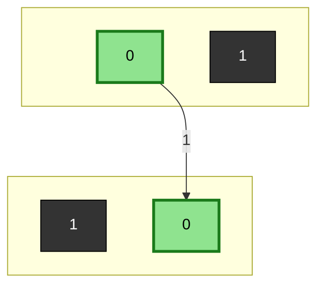
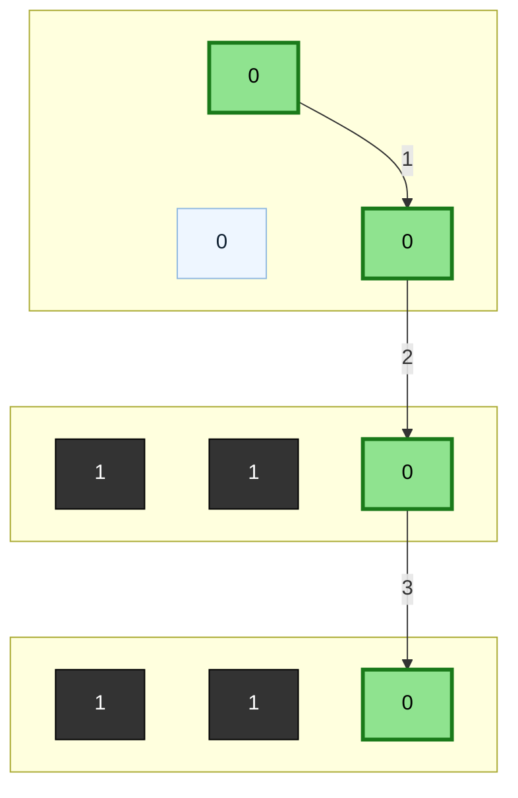
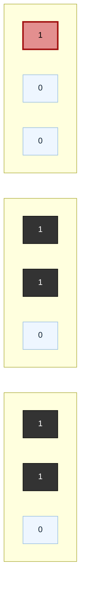
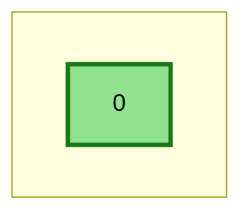
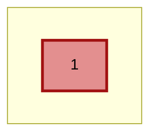
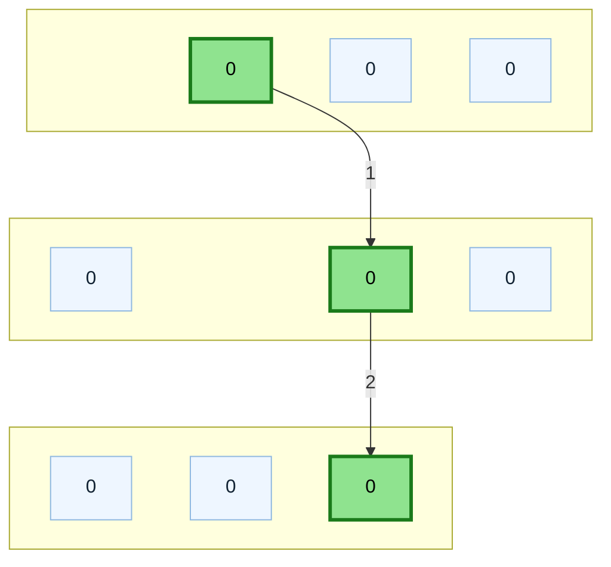
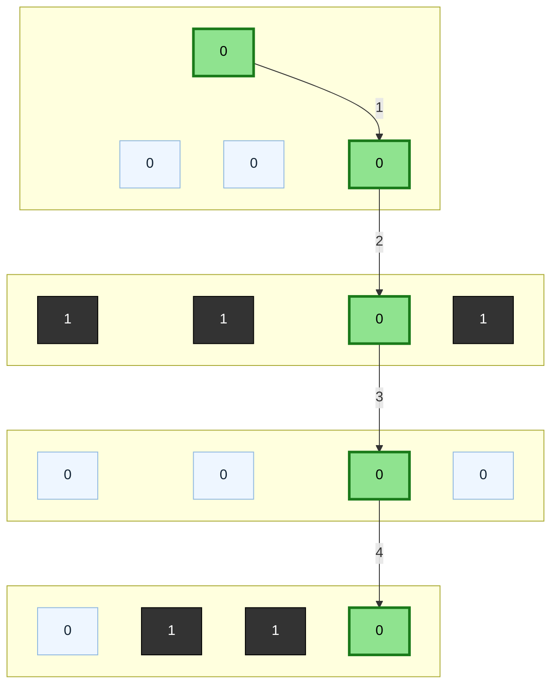

# Shortest Path in Binary Matrix

**Date added:** 2026-08-27

## Problem Description

Given an `n x n` binary matrix `grid`, return the length of the shortest clear path in the matrix. If there is no clear path, return `-1`.

A clear path in a binary matrix is a path from the top-left cell (i.e., `(0, 0)`) to the bottom-right cell (i.e., `(n - 1, n - 1)`) such that:

- All the visited cells of the path are `0`.
- All the adjacent cells of the path are 8-directionally connected (i.e., they are different and they share an edge or a corner).

The length of a clear path is the number of visited cells of this path.

**Source:** https://leetcode.com/problems/shortest-path-in-binary-matrix

## Examples

Legend for the diagrams: green squares are cells on the shortest path (numbered in visit order), dark squares are `1`s (blocked), light squares are `0`s not used by the path, and red squares mark a `0`/`1` cell whose value makes the trip impossible.

**Example 1**
```
Input: grid = [[0,1],[1,0]]
Output: 2
Explanation: The only way from (0,0) to (1,1) is the diagonal step between them, since (0,1) and (1,0) are both blocked. That single move visits 2 cells.
```



**Example 2**
```
Input: grid = [[0,0,0],[1,1,0],[1,1,0]]
Output: 4
Explanation: The path goes right, then diagonally down-right, then straight down: (0,0) → (0,1) → (1,2) → (2,2), visiting 4 cells.
```



**Example 3**
```
Input: grid = [[1,0,0],[1,1,0],[1,1,0]]
Output: -1
Explanation: The start cell (0,0) is itself a 1, so no clear path can begin. No path exists regardless of the rest of the grid.
```



**Example 4**
```
Input: grid = [[0]]
Output: 1
Explanation: The grid is a single cell, and it is open. The start and end are the same cell, so the path is just that one cell.
```



**Example 5**
```
Input: grid = [[1]]
Output: -1
Explanation: The grid is a single cell, but it is blocked. There is no way to form a path that starts and ends on a 1.
```



**Example 6**
```
Input: grid = [[0,0,0],[0,0,0],[0,0,0]]
Output: 3
Explanation: With no obstacles, the shortest path is the straight diagonal (0,0) → (1,1) → (2,2), since diagonal moves are allowed and cover both a row and a column step at once.
```



**Example 7**
```
Input: grid = [[0,0,0,0],[1,1,0,1],[0,0,0,0],[0,1,1,0]]
Output: 5
Explanation: The direct diagonal (0,0) → (1,1) → (2,2) → (3,3) is blocked at (1,1). The shortest detour is (0,0) → (0,1) → (1,2) → (2,2) → (3,3): right, diagonal down-right, straight down, diagonal down-right. A path forced fully through (1,1) and (2,2) would need only 4 cells, but since (1,1) is blocked, 5 is the best possible.
```



## Constraints

- `n == grid.length`
- `n == grid[i].length`
- `1 <= n <= 100`
- `grid[i][j] is 0 or 1`

## Hints

1. Think of this as a graph problem: each `0` cell is a node, and an edge connects two nodes if they're 8-directionally adjacent and both `0`.
2. What algorithm finds the shortest path between two nodes in an unweighted graph?
3. Breadth-first search explores the grid level by level, and each level corresponds to one more cell added to the path.
4. Check that both the start `(0,0)` and end `(n-1,n-1)` cells are `0` before searching — if either is blocked, no path can exist.
5. Mark a cell as visited the moment you enqueue it (not when you dequeue it), so you don't enqueue the same cell multiple times through different neighbors.
